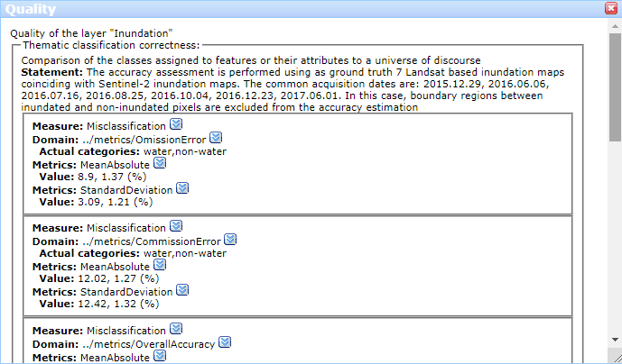
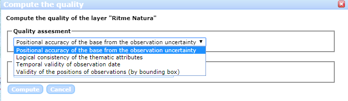
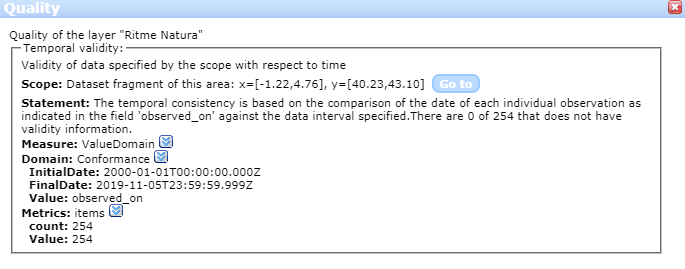
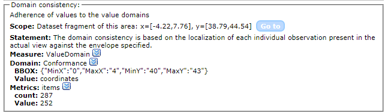

[[DataQuality]]
== Data quality estimations in the client side
One of the main concerns in using and adopting citizen science based data is the quality of observations. Citizen Observatories (and, by extension, Citizen Science) are particularly sensible to data quality because the number of contributors is bigger and more heterogeneous than in a traditional data survey campaign. An additional difficulty is that active Citizen Observatories are receiving continuous inputs and updates from citizens. GroundTruth 2.0 has developed a tool to document well the quality of datasets in order to increase the trust on the information collected by citizens integrated in the MiraMon Map browser.

The tool requires that data is exposed in the Web as a service using Sensor Observation Service (SOS). It presents a set of tests like positional accuracy, attribute consistency or confusion matrix that can be applied to a complete dataset or to an area the user is visualizing. Results include an overall quality indicator for the dataset.

The Ground Truth 2.0 Data Quality tool uses an interoperable approach based on QualityML that allows to parametrize the different statistics that are used to assess the quality of the data, and it focus on data quality indicators for Citizen Science datasets from the QualityML list. The quality module is encoded in JavaScript and has been made available as part of the web based MiraMon Map Browser (https://github.com/joanma747/MiraMonMapBrowser).

=== Quality estimation on vector data
The SOS protocol and the GetObservation operation enables a client to retrieve all the information about the results of the observations. With this data, the client can perform all sorts of analysis on the observations including to apply some quality checks. This section will discuss a pilot that was done in the GroundTruth 2.0 project that demonstrates this capability in some practical cases.

The selected cases and its implementation is based on the QualityML vocabulary. The scenario of rapidly growing geodata catalogues requires tools focused on facilitate users the choice of products. QualityML is a dictionary that contains hierarchically structured concepts to precisely define and relate quality levels: from quality classes to quality measurements. This levels are used to encode quality semantics for geospatial data by mapping them to the corresponding metadata schemas. The benefits of having encoded quality semantics, in the case of data producers, are related with improvements in their product discovery and better transmission of their characteristics. In the case of data users, they would better compare quality and uncertainty measures to take the best selection of data as well as to perform dataset intercomparison. Also it allows other components (such as visualization, discovery, or comparison tools) to be quality-aware and interoperable. On one hand, the QualityML is a profile of the ISO geospatial metadata standards (e.g. ISO 19157) providing a set of rules for precisely documenting quality measure parameters that is structured in 5 levels. On the other hand, QualityML includes semantics and vocabularies for the quality concepts. Whenever possible, it uses statistic expressions from the UncertML dictionary (http://www.uncertml.org) encoding. However it also extends UncertML to provide a list of alternative metrics that are commonly used to quantify quality beyond the uncertainty concept.

==== How data quality is presented
Datasets can have precomputed data quality indicators associated. This is part of the metadata of the datasets, but in the map browser it has a prominent place in the _quality_ option in the context menu of the layer name in the legend.

[#img-DQ-quality,reftext='{figure-caption} {counter:figure-num}']]
.Data Quality context menu
image::images/dq-quality.png[DQ Quality]

Data quality indicators are presented following the QualityML model. For a quality class (in the <> "Thematic classification correctness"), there could be one or more quality measures (in the <> "Misclassification"), that are done by applying some metrics (in the <> "MeanAbsolute and StandardDeviation") over a domain (in the first entry of <> "Omission Error" over the categories "water" and "no water")

[#img-DQ-indicator-qml,reftext='{figure-caption} {counter:figure-num}']]
.Data Quality indicators presented following the QualityML data model.

Every concept used here is connected to the QualityML vocabulary to know more details about it.

[#img-DQ-mean-absolute-qml,reftext='{figure-caption} {counter:figure-num}']]
.Connection to the QualityML dictionary.
image::images/dq-mean-absolute-qml.png[DQ Indicator in QualityML]

==== How to start computing data quality
The MiraMon Map Browser described in the section <<SOS_Client>> allows for computing some data quality indicators. To start the process, we should select the right option in the context menu by clicking in the layer name in the legend.

[#img-DQ-compute,reftext='{figure-caption} {counter:figure-num}']]
.Data Quality compute context menu
image::images/dq-compute.png[DQ Compute]

This option opens a dialog box that offers a short list of four quality indicators that will grow with new tests.

[#img-DQ-indicator,reftext='{figure-caption} {counter:figure-num}']]
.Data Quality indicator list

==== Case 1: Positional accuracy of the layer from observation uncertainties
Many citizen Science projects, use a mobile phone to get observations. In this process they use the location capabilities of the phone, including GPS, 3G triangulation, Wify antenna location or IP address registration. Each of this methods has different known positional accuracies and the phone is able to estimate that ad the same time as it estimates the position. In this case we will assume that the individual observations has got a position an some estimation of the positional uncertainty and this are recorded by the service and offered as properties of the observation.

To compute this indicator we should select the property associated with the observation that contains the positional uncertainty.

[#img-DQ-positional-uncertainty-field,reftext='{figure-caption} {counter:figure-num}']]
.Selection of the positional uncertainty field
image::images/dq-positional_uncertainty_field.png[Positional Uncertainty Field]

The calculated data quality parameter is not shown immediately but added to the previous recorded data quality indicators.

[#img-DQ-done,reftext='{figure-caption} {counter:figure-num}']]
.Calculation complete message
image::images/dq-done.png[DQ done]

The result is a quality report that can be found in the `quality` option in the context menu by clicking in the layer name in the legend.

[#img-DQ-positional_accuracy,reftext='{figure-caption} {counter:figure-num}']]
.Calculated positional accuracy
image::images/dq-positional_accuracy.png[DQ positional accuracy]

Several things can be commented here. The first one indicates that the scope is not the full dataset but the view used for calculating the quality indicator: "Dataset fragment of this area: x=[-1.22,4.76], y=[40.36,42.97]". Secondly, the statement reports that not all observations has positional uncertainties: "There are 140 of 254 that does not have uncertainty information". The accuracy is reported as a _half-length confidence interval_ with a confidence _level_ of 0.683. An uncertainty of 180.39m is not particularly good indicating the heterogeneity of the methods used to calculate the positions of the observations, some of the with big uncertainties.

==== Case 2: Logical consistency of the thematic attributes
Many Citizen Science projects provide the citizens with comprehensive instructions on how to conduct some observational tasks. In some cases observations are limited to a set of possibilities for a list. In cases more complex, once selected an option in the first list, only some values are possible in a second list. Sometimes apps control user inputs preventing citizens to input a value that is not listed in the instructions, but in some cases (such as bulk input form a csv) there might be no controls and unwanted values or incompatible value combinations could end up in the database.

In the case of RitmeNatura citizen observatory, we rely on Natusfera software that is designed for biodiversity in general allowing any possible scientific name while RitmeNatura is asking for a limited set of species. Obviously, if nobody filters them, there is a chance that observations report on species not contemplated by the RitmeNatura subset.

The logical consistency test can count how many observations are not consistent with a controlled list of possibilities. To compute this indicator we should select the property (or properties) associated with the observation that are affected by a controlled list of possibilities and list the possible combinations of attributes. In this simple case, we will test if the `scientific name` is compatible with the list of possibilities described in the legend.

[#img-DQ-logical-consistency,reftext='{figure-caption} {counter:figure-num}']]
.Computation of logical consistency
image::images/dq-logical-consistency.png[DQ Logical Consistency]

A new quality indicator will be added to the list of quality indicators related to this layer.

[#img-DQ-logical-consistency-result,reftext='{figure-caption} {counter:figure-num}']]
.Domain consistency result
image::images/dq-logical-consistency-result.png[DQ Logical Consistency Result]

Only 129 of the 249 species scientific name are consistent with the legend. In addition, 5 observations have no scientific name (probably because the observer did not know it).

==== Case 3: Temporal validity of the observation date
One very simple quality control that can be performed is to check if the observations has an associated data, if the date is in the right format and if the date is in a range of plausible values.

In this example, we test if the observations where done after the year 2000 because we know there should not be observations before this date.

[#img-DQ-temporal-validity,reftext='{figure-caption} {counter:figure-num}']]
.Computation of temporal validity
image::images/dq-temporal-validity.png[DQ Temporal Validity]

A new quality indicator will be added to the list of quality indicators related to this layer.

[#img-DQ-temporal-validity-result,reftext='{figure-caption} {counter:figure-num}']]
.Temporal validity result

In this case we see that all the observations has passed the test.

==== Case 4: Validity of the positions of observations (by bounding box)
One very common mistake in data gathering projects is the presence of observations in places that does not have much sense. Tipical mistakes is swap latitude and longitude values or simply have them in the middle of the Atlantic ocean at the 0,0 position.

In this cases we are going to run a test to find how many observations are in the Catalonian bounding box.

[#img-DQ-positional-validity,reftext='{figure-caption} {counter:figure-num}']]
.Computation of positional validity
image::images/dq-position-validity.png[DQ Positional validity]

A new quality indicator will be added to the list of quality indicators related to this layer.

[#img-DQ-positional-validity-result,reftext='{figure-caption} {counter:figure-num}']]
.Positional validity result

The result identifies 35 observations in this view that are clearly outside the boundaries of Catalonia.

=== Quality estimation on raster data
As explained before, the WMS protocol can be used to transport binary arrays instead of pictures. During this Interoperability experiment, we have implemented a comparison functionality that can be used to compare two categorical maps with the same legend. This comparison results in a new map with all combinations of the two maps categories allowing us to discover changes in this maps.

This can be used to compare maps but also to quality control maps if we assume that one map represents the truth.

==== Confusion matrix
In this exercise we will combine one land cover map created from Open Street Map with another one created by remote sensing.

[#img-DQR-coimbra,reftext='{figure-caption} {counter:figure-num}']]
.Open street map version of the land use map
image::images/dqr-coimbra.png[DQ OSM LUM]

[#img-DQR-creaf,reftext='{figure-caption} {counter:figure-num}']]
.Remote sensing version of the land use map
image::images/dqr-creaf.png[DQ RS LUM]

[#img-DQR-lum-legend,reftext='{figure-caption} {counter:figure-num}']]
.Land use map legend
image::images/dqr-lum-legend.png[DQ LUM legend]

The process of creating a confusion matrix starts by requesting the combination of both maps in a single layer those pixels will contain classes that are all possible permutations of the legend. In the <> the Coimbra version is the one generated from OSM while the CREAF-RS version is the one created by remote sensing. The result of the combination is shown in <>. In principle even the number of combinations is 25, there are only 5 many colors present, corresponding to the classes that are the same in both maps.

[#img-DQR-layer-combination,reftext='{figure-caption} {counter:figure-num}']]
.Request for a layer combination of both land use maps
image::images/dqr-layer-combination.png[DQ Layer combination LUM request]

Now we can request the confusion matrix as a statistical summary of the combination by selecting the option in the context menu.

[#img-DQR-layer-combination-result,reftext='{figure-caption} {counter:figure-num}']]
.Layer combination of both land use maps
image::images/dqr-layer-combination-result.png[DQ Layer combination LUM]

The diagonal values of the matrix (represented in green) correspond to the pixels that have the same value in both maps. The non-diagonal values are the pixels that has different classes in both maps. We can also see some information about the most similar classes (_artificial surfaces_ and _forest and semi natural areas_) as well as the Kappa coefficient that is 0.81 (the closes to 1 the better).

[#img-DQR-confusion-matrix-request,reftext='{figure-caption} {counter:figure-num}']]
.Request for the confusion matrix
image::images/dqr-confusion-matrix-request.png[DQ confusion matrix request]

A manual exploration of the dataset allow to discover a big purple area the is _artificial surfaces_ from the OSM and _forest and semi natural areas_ from the RS map.

[#img-DQR-confusion-matrix-result,reftext='{figure-caption} {counter:figure-num}']]
.Request for the confusion matrix result
image::images/dqr-confusion-matrix-result.png[DQ confusion matrix LUM]

[#img-DQR-layer-combination-confusion,reftext='{figure-caption} {counter:figure-num}']]
.Zoom to an area of discrepancies
image::images/dqr-layer-combination-confusion.png[DQ confusion zoom LUM]

[#img-DQR-layer-combination-confusion-reason,reftext='{figure-caption} {counter:figure-num}']]
.Reason for the discrepancies
image::images/dqr-layer-combination-confusion-reason.png[DQ confusion reason]

The discrepancy makes sense. A big park in the city is identified as artificial in the OSM version that is more focus on land use while is seen as a forest area from remote sensing due to its green land cover.

=== Future work
There are some points the authors of this chapter believe it is worth to develop or explore.

* In the implementation of the confusion matrix there is no connection to the QualityML. It should be done.
* Highlight the observations that were detected as less accurate could be an interesting feature to have.
* We would like to be able to share the quality assessments with other users. One possibility is usinge the OGC Geospatial user feedback to report data quality assessments and share them with other users. Saving the quality report in the NiMMbus database (www.opengis.uab.cat/nimmbus) implemented in the NextGEOSS project will allow that.
* The computations done in the MiraMon map browser are just an small subset of the QualityML vocabulary. We would like to extend the implementation to cover a better range of possibilities.
* QualityML is a vocabulary for data quality. The OGC definitions server presented in <<DefinitionServer>> is a generic tool to share vocabularies. Translating QualityML into a format that can be ingested by the Definitions Server should be a priority of the next interoperability experiment.
