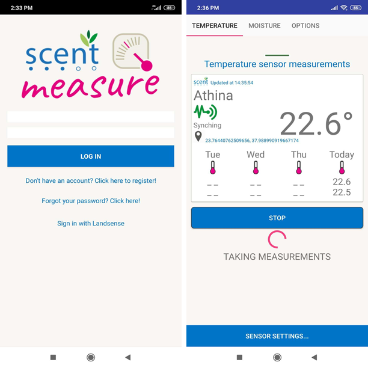

[[SSO]]
== User and Application Federation

In the Interoperability experiment, we experimented with the federated identity provider developed in the project H2020 LandSense as Authorization Server that enables a federation of applications with user Single-Sign-On.

The Landsense project contributed the Engagement Platform (https://lep.landsense.eu/Project/LEP), the H2020 Scent project contributed the Scent Harmonisation Platform Visualisation Site (https://scent-harm.iccs.gr/) as well as the Scent Explore and Measure mobile applications (https://scent-project.eu/scent-toolbox) and the H2020 NextGEOSS contributed the NiMMbus Geospatial user feedback system (https://www.opengis.uab.cat/nimmbus/). The abovementioned platforms and applications were able to work together and use the LandSense Authorization Server to authenticate users and create a Single-Sign-On experience. From the user perspective, once logged in one of the platforms it can use the other two in a transparent way without having to authenticate again.

[#img-federation-diagram,reftext='{figure-caption} {counter:figure-num}']]
.Federation diagram
image::images/federation-diagram.png[Federation diagram]

The federation is designed in a way that its complain with the GDPR EU regulation and the user is in full control of which information is released, to whom for a partciluar purpose. When registering an application with the Authorization Server, the operator of the application must declare which personal information of the user is required. To the first extreme, an application can be registered to not require any personal information. On the other end of the spectrum, an application can request personal information and the user must approve the flow of the personal information to the application, the first time the application is used. Once approved, the user can revoke the approval which will stop the application from obtaining personal information.

=== The LandSense Authorization Server

The Authorization Server (AS) supports users to login from a variety of login providers including social media, organizations and academic institutions participating in eduGAIN. Based on the trust in the login providers, registered applications, services, tools and Application Programming Interfaces (APIs) can be used by operating a RFC 6750 compliant Open Authorization 2 (OAuth2) Resource Server that accepts either JSON Web Token (JWT) or Bearer Access Tokens from any LandSense compliant OAuth2/OpenID Authorization Server.

The Authorization Server is extensible to any other login providers as long it is compliant with the federation requirement regarding the participation as a login provider: deployment of a Security Assertion Markup Language v2 (SAML2) compliant Identity Provider. The LandSense Coordination Centre digitally signs and hosts the SAML2 metadata for the LandSense federation by which trust is established between the SAML2 Identity Providers and the Authorization Server.

The LandSense Authorization Server acts as a GDPR compliant broker between the personal information received after a user’s login and registered applications based on user approval. In order to honour GDPR data minimisation, the AS requests from the Identity Provider (IdP) at login only that amount of personal information, as it is required by a registered application. This amount (and which attributes in detail) is controlled by the registration / login level. The AS provides five levels of which the first two do not enable an application to obtain personal information: AUTH, CRYPTONAME, SAML, PROFILE, EMAIL, PROFILE+EMAIL. It can be extended to other levels like ADDRESS and PHONE.

[[SSOLevelsOfPrivacy]]
==== Levels of personal information
*AUTH*: Any application that is registered with this level must not be GDPR compliant, as there is no information about the user other than “yes we know that you have successfully logged in with one of the trusted IdPs). After login with Level AUTH the user will not see any personal information.

An example application could be a simple geo-fencing service where there only is polygons in and out.

*CRYPTONAME*:
Any application that is registered with this level will receive a cryptoname for the user. This cryptoname is unique across all trusted IdPs and generated after a successful login. Based on the concept of creating a cryptoname for a user, it can be guaranteed that the identifier is still correct after more IdPs join. At the current state, LandSense federation trusts approx. 2850 Identity Providers worldwide.

The cryptoname is not stored at the Authorization Server which ensures that no personal information can be obtained based on the single possession of the cryptoname. This allows applications to cluster (group) user contributions without knowing the real identity of the user. Because of that, any registered application processing just the cryptoname must not be GDPR compliant.  After login with Level CRYPTONAME you will see your cryptoname as value of the personal claim “sub”.

An example API registered with this level could generate quality indexes on citizen science contributions based on user contributions stored at participating Resource Servers without knowing the actual identity of the original user(s). Even though a Resource Server stores more personal information, only the cryptoname would be released (with the actual data), as the level(s) can be verified with the Authorization Server.

*SAML*:
This level allows the registered application to obtain metadata about the Identity Provider, the user has used to login:  country, federation identifier, and name of the federation the IdP is registered with. This level can used as an add-on for the levels PROFILE and EMAIL.

For an application that operates with CRYPTONAMEs, this level is a valuable add-on as it allows to associate the user with one IdP.

*PROFILE*: Any application that is registered with this level will be able to receive personal information as defined in the OpenID Connect specification for the scope profile (https://openid.net/specs/openid-connect-core-1_0.html) after the user has given their approval. Any application operating on this level must be fully GDPR compliant, which means that the registration process requires to provide a URL to the privacy statement of the application. This privacy statement defines which personal information is requested, for which purpose and which operators will be able to also process the personal information. After login with Level PROFILE you will see the cryptoname plus all available personal information that fall into the scope profile.

*EMAIL*: Any application that is registered with this level will be able to receive personal information as defined in the OpenID Connect specification for the scope profile (https://openid.net/specs/openid-connect-core-1_0.html) after the user has given their approval. Any application operating on this level must be fully GDPR compliant, which means that the registration process requires to provide a URL to the privacy statement of the application. This privacy statement defines which personal information is requested, for which purpose and which operators will be able to also process the personal information. After login with Level EMAIL you will see the cryptoname plus all available personal information that fall into the scope profile.

*PROFILE+EMAIL*: This is a combination of scopes PROFILE and EMAIL. After login you see your crypto name, email address, whether it is validated and all the personal information received for scope profile.

==== How to register an application

Any application (mobile, web browser based, native or API) that supports OpenID Connect can be registered with the LandSense Authorization Server (OpenID Connect Provider). Assuming successful registration, the application can then use other provisioning and offerings from other registered APIs leveraging access tokens.

[#img-Landsense-application-registration,reftext='{figure-caption} {counter:figure-num}']]
.Federation Application Registration
image::images/LandsenseApplicationRegistration.png[Federation app registration]

=== LandSense Engagement Platform

In a nutshell, the LandSense Engagement Platform (https://lep.landsense.eu) is to become the marketplace where citizens can participate in the various Land Use and Land Cover (LULC) related campaigns and interested parties can reuse existing services and register new applications.

The first version of the LandSense Engagement Platform was realized based on the existing tools, services and platforms from LandSense partners as well as new applications built for the Demo Cases.

[#img-Landsense-login,reftext='{figure-caption} {counter:figure-num}']]
.LandSense Engagement Platform login
image::images/LandsenseLogin.png[LEP login]

=== Scent Harmonization Platform
Scent Harmonisation Platform Visualisation Site (https://scent-harm.iccs.gr/) is a client application tailored for the purposes of inspecting and visualising traditional in-situ and citizen-generated observations.

The Visualisation site constitutes a custom innovative application that exposes the resources made available from the Scent Harmonisation Platform. The application conforms to OGC SensorThings API standard and it consists of the following main characteristics:

* User-friendly interfaces enabling both time-series analysis and spatial representation of SensorThings API resources including graphical visualisations with filtering capabilities per observed phenomenon and sensor as well as low-level interaction with the Harmonisation Platform SensorThings driven schema.
* An interactive campaign dashboard that enables the spatial visualisation and graphic representation of the images of Land Cover/ Land Use elements that have been collected from the volunteers in the context of the project's citizen science campaigns.

Scent Harmonisation Platform manages a variety of citizen-generated data as well as environmental data that has been collected through in-situ monitoring stations in Kifisos river basin, Attica, Greece. All the data are being maintained and have been structured according to widely accepted standards, such as the Open Geospatial Consortium (OGC) in order to be compliant with open and unified frameworks (such as SensorThings API).

Details regarding the integration of Scent Harmonisation Platform Visualisation Site with LandSense authorisation server are provided in Annex D.

[#img-Scent-Harmonization-Platform-Login,reftext='{figure-caption} {counter:figure-num}']]
.Scent Harmonization Platform Login
image::images/ScentHarmonizationPlatform.png[Scent Harmonization Platform]

=== Scent Explore
Scent Explore is a mobile application that enables citizens to capture environmental related information. It provides a user-friendly interface through which citizens are guided to areas where essential environmental information is needed. There, they may collect images of LC/LU elements along with textual descriptions, measure water level and flow velocity and report flood related events like the existence of obstacles in the river, flooded locations, etc. Citizens use the app in a playful way, by discovering and collecting little characters hiding in places around them and thus collecting points.

Details regarding the integration of Scent Explore with LandSense authorisation server are provided in Annex D.

[#img-Scent-Explore-application,reftext='{figure-caption} {counter:figure-num}']]
.Scent Explore Application Login
image::images/ScentExplore.png[Scent Explore application]

=== Scent Measure
Scent Measure is a mobile application that works in tandem with a potable smart sensor (Xiaomi International Version Flower Care Smart Monitor), connected to the user’s mobile device aiming to measure soil conditions. Users can simply insert the sensor into the ground and, select whether to measure and report soil moisture levels and/or air temperature and receive the measurements directly to the app.

It constitutes an Android application that has been developed with Java as it enables easy system modelling and has support for many cross-platform software libraries.
The Scent Measure application, can be easily modified/adapted to support any kind of smart measuring sensors providing they have a Bluetooth connection interface with the portable devices and Bluetooth support for the messages exchange from the sensor to the portable device.

Details regarding the integration of Scent Measure with LandSense authorisation server are provided in Annex D.

[#img-Scent-Measure-application,reftext='{figure-caption} {counter:figure-num}']]
.Scent Measure Application Login

=== NiMMBus Geospatial User Feedback
The NiMMBus web portal records geospatial user feedback about existing geospatial resources. The user is able to provide comments, rates, quality reports and publications related to a geospatial resource. It can be used to comment on datasets but also on individual observations. The system allows to creating a citation of an external resource (in an external catalogue or repository) and associate feedback items about it. It builds upon a service developed in the H2020-funded NextGEOSS project. Registered as an Web Browser based application with the LandSense Authorization Server, the application can be used to collect user feedback with resources provided by other Resource Servers (APIs) also registered with the LandSense Authorizaiton Server.

The system is based on the NiMMbus; a solution for storing geospatial resources on the MiraMon cloud. The system implements the Geospatial User Feedback (GUF) standard developed in the OGC GUF (and started in the FP7-funded GeoViQua project).

The solution is composed by three elements: the open source code for a JavaScript the client, a server that stores the feedback information and a well document API that allows for interacting with the client.

[#img-NiMMbus-GUF,reftext='{figure-caption} {counter:figure-num}']]
.NiMMbus  NiMMBus Geospatial User Feedback Login
image::images/NiMMbusGUF.png[NiMMbus GUF]
