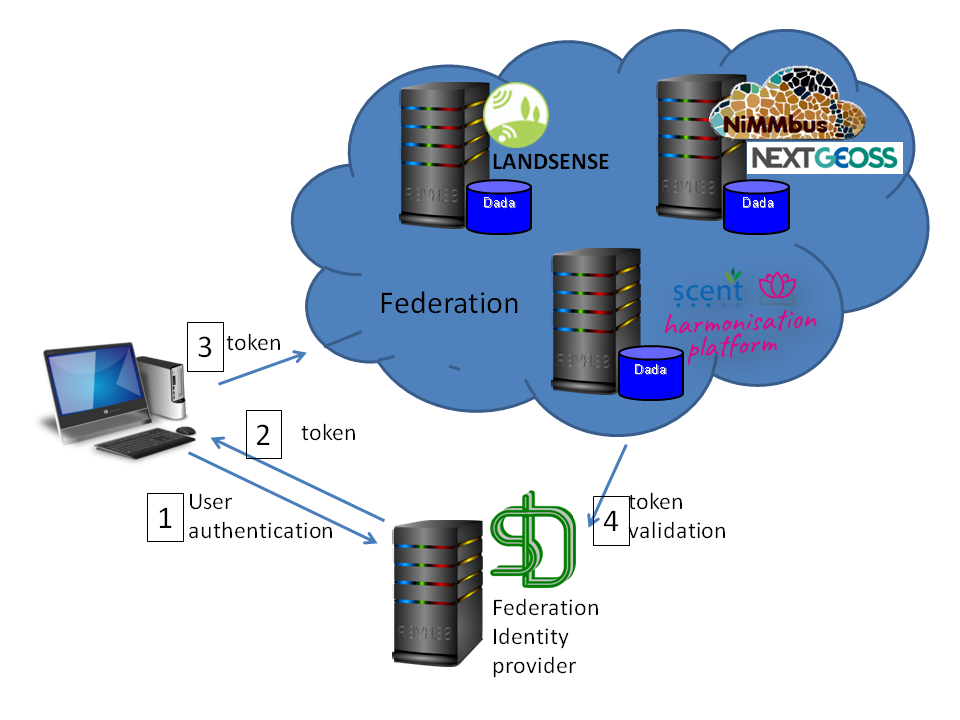

[[SSO]]
== User authentication and applications federation

In the Interoperability experiment, we experimented with the federated identity provider developed in the project H2020 Landsense as authorization server that enables a federation of applications.

The Landsense project contributed the Engagement Platform (https://lep.landsense.eu/Project/LEP), the H2020 Scent project contributed the Scent Harmonisation Platform Visualisation Site (https://scent-harm.iccs.gr/) and the H2020 NextGEOSS contributed the NiMMbus Geospatial user feedback system (https://www.opengis.uab.cat/nimmbus/). The three platforms were able to work together and use the Landsense authorization server to authenticate users and create a Single Sign On experience. From the user perspective, once logged in one of the three platforms it can use the other two in a transparent way without having to authenticate again.

[#img-federation-diagram,reftext='{figure-caption} {counter:figure-num}']]
.Federation diagram

The federation is designed in a way that is complain with the GDPR EU regulation and the user is in full control of which information is releasing, to whom and with that purpose. In an extreme case, the user can decide to do not release any adentity information to an application in the federation.

=== The LansSense Authorization Server

With the Authorization Server (AS), the federation supports users to authenticate from a variety of login providers including social media, organizations and Academic institutions participating in eduGAIN. Based on the trust in the login providers, services, tools and Application Programming Interfaces (APIs) can be provided to the platform by either operating a compliant SAML2 Service Provider or an Open Authorization 2 (OAuth2) Resource Server that accepts JSON Web Token (JWT) Access Tokens from any LandSense compliant OAuth2/OpenID Connect Provider.

The platform is extensible to any other login providers as long it is compliant with the Federation requirement regarding the participation as a login provider: deployment of a Security Assertion Markup Language v2 (SAML2) compliant Identity Provider. The LandSense Coordination Centre digitally signs and hosts the SAML metadata of the Engagement Platform by which trust is established between the SAML2 Identity and the Service Providers (the LandSense Federation).

The LandSense Authorization Server acts as a GDPR compliant broker between the personal information received after a user’s login and registered applications based on user approval. In order to honour GDPR data minimisation, the AS requests from the Identity Provider (IdP) at login only that amount of personal information, as it is required by a registered application. This amount (and which attributes in detail) is controlled by the registration / login level. The AS provides five levels of which the first two do not enable an application to obtain personal information: AUTH, CRYPTO, PROFILE, EMAIL, PROFILE+EMAIL.

[[SSOLevelsOfPrivacy]]
==== Five levels of personal information in the federation
AUTH: Any application that is registered with this level must not be GDPR compliant, as there is no information about the user other than “yes we know that you have successfully logged in with one of the LandSense IdPs). After login with Level AUTH you will not see any personal information.

CRYPTONAME:
Any application that is registered with this level will receive a crypto name for the user. This crypto name is unique in LandSense and generated after a successful login. The crypto name is not stored which ensures that no personal information can be obtained based on the single possession of the crypto name. This allows applications to cluster (group) user contributions without knowing the real identity of the user. Because of that, any registered application processing the crypto name must not be GDPR compliant.  After login with Level CRYPTO you will see your crypto name as value of the personal claim “sub”.

PROFILE: Any application that is registered with this level will be able to receive personal information as defined in the OpenID Connect specification for the scope profile (provide URL) after the user has given their approval. Any application operating on this level must be fully GDPR compliant, which means that the registration process requires to provide a URL to the privacy statement of the application. This privacy statement defines which personal information is requested, for which purpose and which operators will be able to also process the personal information. After login with Level PROFILE you will see the crypto name plus all available personal information that fall into the scope profile.

EMAIL: Any application that is registered with this level will be able to receive personal information as defined in the OpenID Connect specification for the scope profile (provide URL) after the user has given their approval. Any application operating on this level must be fully GDPR compliant, which means that the registration process requires to provide a URL to the privacy statement of the application. This privacy statement defines which personal information is requested, for which purpose and which operators will be able to also process the personal information. After login with Level EMAIL you will see the crypto name plus all available personal information that fall into the scope profile.

PROFILE+EMAIL: This is a combination of scopes PROFILE and EMAIL. After login you see your crypto name, email address, whether it is validated and all the personal information received for scope profile.

==== How add an web application into the federation

Any application (mobile or web browser based) can be included if they support OpenID connect and the are registered with the LandSense OpenID Connect provider. Assuming successful registration, the application can then be used on own provisioning and offerings from the Federation.

[#img-Landsense-application-registration,reftext='{figure-caption} {counter:figure-num}']]
.Federation Application Registration
image::images/LandsenseApplicationRegistration.png[Federation app registration]

=== LandSense Engagement Platform

In a nutshell, the LandSense Engagement Platform (https://lep.landsense.eu) is to become the marketplace where citizens can participate in the various Land Use and Land Cover (LULC) related campaigns and interested parties can reuse existing services and register new applications.

The first version of the LandSense Engagement Platform was realized based on the existing tools, services and platforms from LandSense partners as well as new applications built for the Demo Cases.

[#img-Landsense-login,reftext='{figure-caption} {counter:figure-num}']]
.LandSense Engagement Platform login
image::images/LandsenseLogin.png[LEP login]

=== Scent Harmonization Platform
Scent Harmonisation Platform Visualisation Site (https://scent-harm.iccs.gr/) is a client application tailored for the purposes of inspecting and visualising traditional in-situ and citizen-generated observations.

The Visualisation site constitutes a custom innovative application that exposes the resources made available from the Scent Harmonisation Platform. The application conforms to OGC SensorThings API standard and it consists of the following main characteristics:

* User-friendly interfaces enabling both time-series analysis and spatial representation of SensorThings API resources with support to time-series analysis, metadata and visualisation and a dashboard.
* An interactive campaign dashboard that enables the spatial visualisation and graphic representation of the images of Land Cover/ Land Use elements that have been collected from the volunteers

Scent Harmonisation Platform manages a variety of citizen-generated data as well as environmental data that been collected through in-situ monitoring stations in Kifisos river basin, Attica, Greece. All the data are being maintained and have been structured according to widely accepted standards, such as the Open Geospatial Consortium (OGC) in order to be compliant with open and unified frameworks (such as SensorThings API).

[#img-Scent-Harmonization-Platform-Login,reftext='{figure-caption} {counter:figure-num}']]
.Scent Harmonization Platform Login
image::images/ScentHarmonizationPlatform.png[Scent Harmonization Platform]

=== NiMMBus Geospatial User Feedback
The NiMMBus web portal records geospatial user feedback about existing geospatial resources. The user is able to provide comments, rates, quality reports and publications related to a geospatial resource. It can be used to comment on datasets but also on individual observations. The system allows to creating a citation of an external resource (in an external catalogue or repository) and associate feedback items about it. It builds upon a service developed in the H2020-funded NextGEOSS project, adding the capability of integration into the LandSense federation authentication.

The system is based on the NiMMbus; a solution for storing geospatial resources on the MiraMon cloud. The system implements the Geospatial User Feedback (GUF) standard developed in the OGC GUF (and started in the FP7-funded GeoViQua project).

The solution is composed by three elements: the open source code for a JavaScript the client, a server that stores the feedback information and a well document API that allows for interacting with the client.

[#img-NiMMbus-GUF,reftext='{figure-caption} {counter:figure-num}']]
.NiMMbus  NiMMBus Geospatial User Feedback Login
image::images/NiMMbusGUF.png[NiMMbus GUF]
