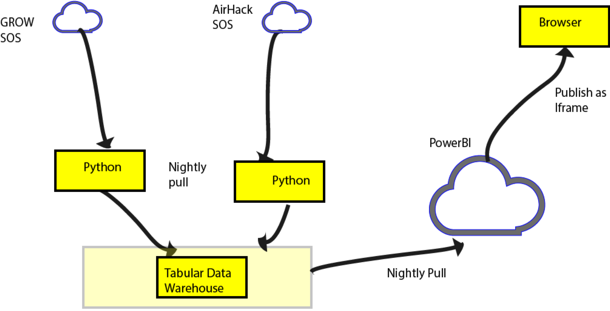
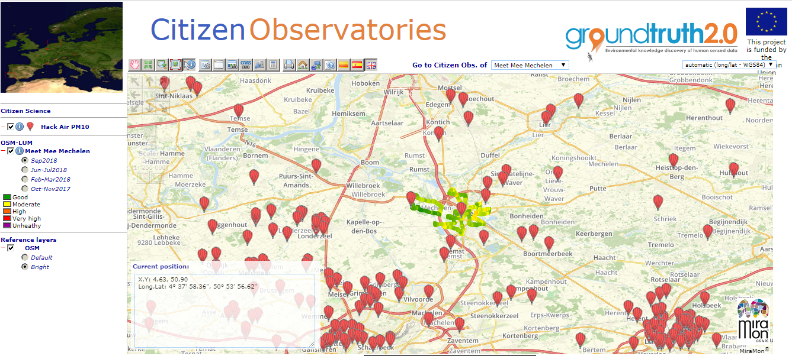
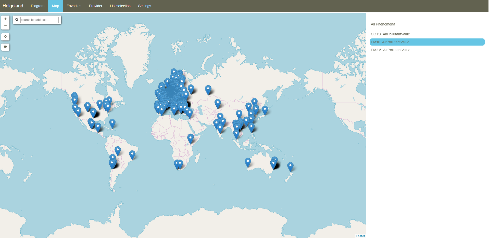
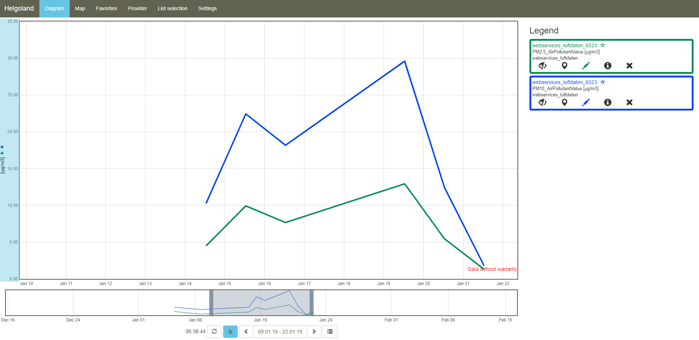

[[SOS_Client]]
== SOS clients
In this chapter we describe three SOS integrated clients tested in the IE.

=== Grow Client
The GROW client is a demonstrator application showing the how data sources can be combined in a tabular data warehouse and off-the-shelf visualization tools can be used to create rich visualizations.  In the case of this demonstrator, Microsoft's PowerBi was used, although commercial tools such as Tableau or Spotfire can be used.  In addition, free tools such as Grafana, Rawgraphs, or Apache Superset can be employed.

The diagram below shows a typical output using PowerBi, showing GROW sensor locations combined with Airhack sensor locations.

[#img-AndyClient,reftext='{figure-caption} {counter:figure-num}']]
.GROW SOS Client
image::images/AndyClient.png[Andy SOS Client]

In this application, data is pulled from two SOS sources (GROW and AirHack) via a python script, usually overnight.  This data is stored in a tabular data warehouse, in this prototype this is just flat files, however a full scale data warehouse such as Microsoft's Analysis services or a tabular database such as Cassandra could be used.

Data from the warehouse is pulled nightly into Microsoft's cloud and then published to a web page that makes heavy use of JavaScript to provide an rich exporable interface.

[#img-GROWSOSFlow,reftext='{figure-caption} {counter:figure-num}']]
.GROW data follow

This approach can be extended to mix different types of data into one visualization.  In the figure below, gridded data (locations of sensors) is combined with time series data so that the user can explore the data more fully.  In this application, when a user click on a sensor, the time series data from that sensor is displayed to the user. In this case, the tool takes the time series data and displays the average, minimum, and maximum of the time series data.

[#img-GrowData,reftext='{figure-caption} {counter:figure-num}']]
.GROW SOS Client data
image::images/GrowData.png[SOS Client]

=== MiraMon Client
The MiraMon map Browser is a long-term developing effort to create a visualization, analysis, and download tool that runs in modern web browsers. Based on HTML5 and JavaScript, it uses OGC web service protocols to connect to web services and show the information to the user. The objective of the development of this tool is to assign to web browser and the JavaScript engine as much work as possible, limiting interactions to the server to the minimum possible and the transfer of information to a format that is as raw as possible. This approach can be surprising: these days are many application which prefer to perform processing functionalities in the cloud and not by the client machine. Most of the time, the MiraMon map Browser is directly responsible for creating the visualization on-the-fly based on the raw data, allowing the user to change visualization properties, perform analysis, statistics, or build time series in the client side directly. In the <<DataQuality>> section, we will show how the same principle can be used to compute overall data set quality can be computed on-the-fly, as well.

Below are the main functionalities and standards used to achieve that functionality.

* Raster visualization and query by location is possible using OGC Web Map Service and Web Map Tile Service.

* Raster analytics is possible by using the OGC Web Map Service in an special way that transmits binary arrays of values (raw or RLE encoded) instead of pictorial representations. Pixel based analysis is performed directly in JavaScript in the client side and visualized on-the-fly.

* Vector visualization and query by location is possible using OGC Web Feature Service and Sensor Observation Service. The client accepts both XML an JSON formats.

* Data download is limited to the use of Web Coverage Service v.1.0.

Several layers of data coming from different servers and using different protocols can be overlaid simultaneously. Some layers represent data from a single dataset while other can be a virtual datasets computed on-the-fly for each zoom and pan and created by combining data from more than one dataset and server.

Both WFS and SOS visualization are currently limited to points that are represented in a HTML5 canvas as icons, circles, and texts and could be easily extended to lines and polygons in the near future. These functionalities were particularly useful to show occasional observations made by citizens in different places. We were able to show together Ground Truth 2.0 observations with HackAir observations using the SOS protocol directly in XML and in JSON. Some of the visualization functionalities were actually improved during the IE, such as the capability to condition the color of a circle by an attribute (or an observed _result_) of the feature. This way, it was possible to represent the level of concentration of a pollutant as a colored circle using a color code that was represented in the legend.

Representing the positions of the observations will require only the GetFeatureOfInterest operation unless the visualization of the feature should depend on the _result_ of the observation. In the later case, a GetObservation is performed and all the information on the features is loaded in the client, making query by location non-dependent on the server.

[#img-MiraMonClient,reftext='{figure-caption} {counter:figure-num}']]
.MiraMon SOS Client

=== 52°North Helgoland Sensor Web Viewer
The Helgoland Sensor Web Viewer developed by 52°North is an open source visualization tool for different kinds of Sensor Web data. It allows exploration of available observation data sets and visualization of the actual data (e.g., time series) as diagrams.

Figure 1 shows the map view of the Helgoland Sensor Web Viewer. In this case, a sample data set of the hackAIR project is explored. The map view shows the locations at which air quality sensors are located.

[#img-HelgolandMapView,reftext='{figure-caption} {counter:figure-num}']]
.52°North Helgoland Sensor Web Viewer - Map View

After selecting a specific measurement location, the data can be visualized as a diagram (see Figure 2). It is possible to combine data from multiple sensors, multiple observed properties, and even from different providers into a single diagram.

[#img-HelgolandDiagramView,reftext='{figure-caption} {counter:figure-num}']]
.52°North Helgoland Sensor Web Viewer - Diagram View

=== SOS Technology Integration Experiments
During the IE, a set of Technology Integration Experiments (TIE) were conducted. In the client and server architecture a TIE is a test that combines a server with a client and demonstrates that communication between client and server is possible and the user (operating the client) is able to see or get some data. The following table summarizes the tests conducted and the degree of success achieved.

[#table_TIE,reftext='{table-caption} {counter:table-num}']
.Technology Integration Experiment results
[width="75%",options="header",align="center"]
|===
| *Servers* | *Data* | *MiraMon Client* | *Helgoland Client* | *Grow Client*
| *MiraMon* | Ground Truth 2.0 ^.^| Yes | |
| *Helgoland* | HackAir | ^.^| Yes |
| *istSOS* | HackAir ^.^| Yes | ^.^| Yes
| *Grow* | Grow | | ^.^| Yes
|===
