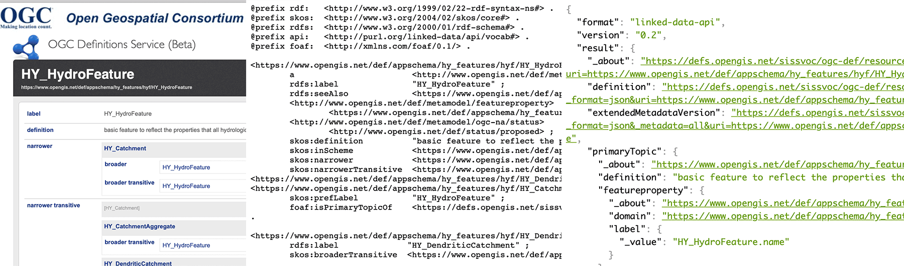
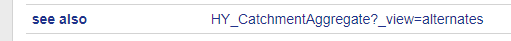

[[DefinitionServer]]
== Definitions Server
The Definitions Server is a service that allows for storing, querying, and linking definitions. The Definitions Server provides a common way to resolve terms published by the OGC and to get details of definitions (instead of downloading large complex documents in varying formats).

Currently, the Definitions Server has a complete set of terms that have been defined by the OGC since the inception of the OGC Naming Authority - which aims to keep all such URL references consistent. In Citizen Science, we can find hundreds of projects dealing with similar topics, but it is difficult to know if they are collecting variables that can be directly compared. By trying to link to a previous definition on the server, terms or variables become connected to other projects. By exposing their definitions in the Definitions Server, other citizen science projects can reuse the same definitions and methodologies.

The Definitions Server has the ability to get machine readable versions of definition details (e.g., JSON to allow simple integration of details into Web and mobile applications). The Definitions Server has a flexible capability to cross-link between terms and the ability to use any information model to extend available details. Further, the Definitions Server allows for per-term or as-package download.

In this IE the Definitions Server was improved and presented by the OGC to the other participants in the IE. As of November 2019, the Definitions Server API is undergoing an upgrade to comply with the emerging W3C Recommendation for "Content Negotiation by Profile" [https://www.w3.org/TR/dx-prof-conneg/]. In the next phase of the IE, we will test the applicability of the Definitions Server for citizen Science purposes.

=== What the Definitions Server does

The OGC Definitions Server is a Web-accessible source of information about things ("concepts") the OGC defines or that communities ask the OGC to host on their behalf. It applies FAIR principles (Findable, Accessible, Interoperable, and Reusable) to the key concepts that underpin interoperability in systems using OGC specifications and standards. These concepts can be anything that is important in the course of interoperability around spatial information where the OGC plays a role in facilitating common understanding - either through publishing standards or assisting communities to share related concepts. OGC uses stable web addresses (URIs) to unambiguously identify concepts in its standards. The Definitions Server makes those URIs "work" - i.e., makes the URIs dereference to a definition that can be used.

The OGC Naming Authority manages the Definitions Server to ensure all URIs are stable with transparent governance. These identifiers can thus be safely used in external context. All content is freely available for re-use. Re-use is envisaged largely through the machine-readable versions.

Examples of content in the Definitions Server include the OGC glossary, technical terms from application schemas  (for example the HY schema from the https://www.opengis.net/def/appschema/hy_features/hyf/HY_HydroFeature [hydrology domain]), and many others.

Even though only limited search capability is currently provided, the Definitions Server is implemented using Linked Data principles - so the combination of stable URIs allowing references to be made from outside and "follow your nose" navigation via links from one concept to related concepts provides enhanced findability.

The Definitions Server does not make any assumptions about the client software that may be used now or in the future other than the use of HTTP protocols. This enhances accessibility for different environments.

The "Web-friendly" way of using an identifier (i.e., a URL) to get more information is augmented by "content negotiation" - the Definitions Server can deliver both user friendly Web pages and other forms of resource representations, e.g., JSON-LD or Turtle (TTL).

<> shows different views of a resource HY_Feature. The left panel shows an HTML representation, the middle shows the same information using TTL, and the right using JSON. All three representations have the same content, but differ in its serialization/format. This allows both human users to explore the OGC Definitions Server, as well as machines to process its content.

[#img-DS_representations,reftext='{figure-caption} {counter:figure-num}']]
.Various representations of the same content (fragments, HTML left, TTL middle, JSON right)

=== Interoperability in the Definitions Server
The interoperability of these resources is a key goal. There are several aspects of this handled using different mechanisms:

* Content model: can the client understand how the data is structured;
* Encoding: can the client parse the response; and
* Interaction: how can a client ask for the form it needs?

==== Content interoperability
The identifiers mentioned above, i.e., the URLs that can deliver content to the user, are termed Concepts and are organized into ConceptSchemes and Collections. Concept, ConceptScheme, and Collections are defined by SKOS. SKOS, the Simple Knowledge Organization System, is a common data model for sharing and linking knowledge organization systems via the Web. SKOS is a W3C Recommendation.

So why SKOS? Many knowledge organization systems, such as thesauri, taxonomies, classification schemes, and subject heading systems, share an almost similar structure and are used in almost similar applications. Even though these systems might even share exact semantics, you need to learn the semantic relationships by explicitly discovering, accessing, and evaluating the content. Without a standardized interface, this endeavor is labor-intensive and can hardly be executed by machines.

SKOS captures much of this similarity and makes it explicit. SKOS enables data and technology sharing across diverse applications by providing a lightweight, intuitive language for developing and sharing knowledge. In most cases, existing knowledge can be transformed into SKOS, because the SKOS data model provides a standard, low-cost migration path for porting existing knowledge organization systems.

==== Encoding Interoperability
The Definitions Server currently offers a range of encodings for all terms: 1. HTML, 2. JSON (using JSON-LD augmentations to specify URLs), 3. RDF (as XML,TTL or JSON-LD), and 4. Plain text.

Where applicable, certain types of resources are also available in the original or additional formats. For example, Application Schemas are available in XML schema (XSD) and UML (XMI) forms.

=== Using the Definitions Server

==== URI access
Access of definitions by following any URI is supported.

The server will respond with a HTTP 303 URI redirect to the current service interface appropriate to the requested profile(view) and format.

http://www.opengis.net/def/docs/03-003r10 ⇒ HTTP 303 Location: http://defs.opengis.net/elda-common/ogc-def/resource?uri=http://www.opengis.net/def/docs/03-003r10

(the actual final resource URL may change as we improve the interface - but the original URI will always work)

==== ConceptSchemes, Collections, and Semantics
Every term belongs to a "ConceptScheme" which will usually be part of the path.

http://www.opengis.net/def/docs/03-003r10 skos:inScheme http://www.opengis.net/def/docs

Each part of the path ending with "/" will represent a Collection that contains a list of members http://www.opengis.net/def/docs policy:collectionView http://www.opengis.net/def/docs/.

Terms may also a non-overlapping set of broader/narrower relationships, with the top of each hierarchy linked via skos:hasTopConcept from the ConceptScheme.

The ConceptSchemes support the following linkages:

1. ConceptSchemes are the "unit of governance" where metadata and download links for sets of definitions can be accessed;

2. Collections are a flexible nested way of listing related subsets of terms - where lists may overlap - but do not state semantic relationships between terms;

3. Terms are the basic resources with definitions; and

4. Terms may be semantically related using broader/narrower and other match (e.g., skos:exactMatch).

==== Search
A basic search capability is provided via the underlying interface: e.g., http://defs.opengis.net/elda-common/ogc-def/concept?labelcontains=Catchment.

[#img-DS_search,reftext='{figure-caption} {counter:figure-num}']]
.Search option
image::images/ds_search.png[Search]

This search capability provides machine readable outputs, if requested, via the _format parameter or the HTTP Accept: header. https://defs.opengis.net/elda-common/ogc-def/concept?labelcontains=Catchment&_format=ttl.

Searches may be constrained to a specific concept scheme:

https://defs.opengis.net/elda-common/ogc-def/concept?labelcontains=Profile&scheme=http://www.opengis.net/def/docs

(note URL encoding is required for parameters with URI values - browsers tend to do this automatically)

==== Downloading Data
Every term includes a link to an "alternates" view.

[#img-DS_alternates_link,reftext='{figure-caption} {counter:figure-num}']]
.Alternates link

(This link can be accessed by qualifying any Definitions Server hosted URIs with _view=alternates or _profile=alternates)

A W3C compliant view for the specific concept (not the dataset as a whole) can be accessed with _profile=all.

This view lists available formats for both the individual term and the collection or package that defines it:

[#img-DS_alternates,reftext='{figure-caption} {counter:figure-num}']]
.Available alternate representations
image::images/ds_alternates.png[Alternates]

ConceptSchemes offer download options for original sources of definitions - for example an Application Schema will have a download link for the canonical UML model file.

Collections allow list of concepts to be downloaded.

Concepts allow simple packages of information about the concept itself to be accessed.
