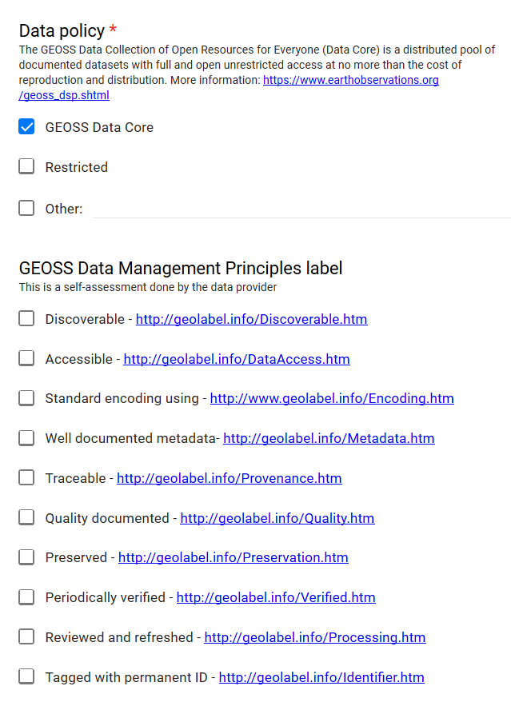
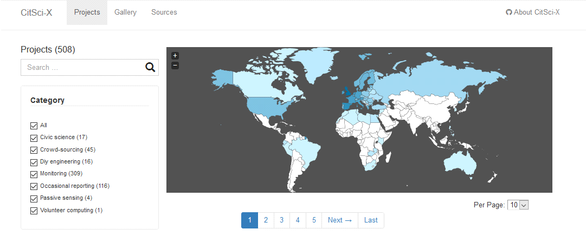
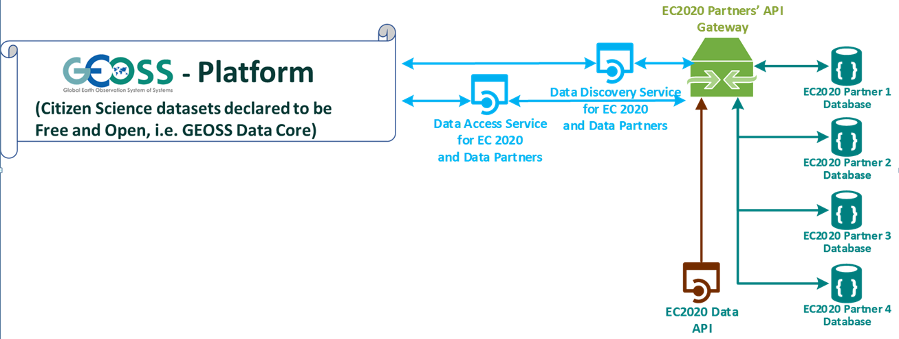

[[CitSciGEOSS]]
== Connecting Citizen Science data sets to GEOSS

In addition to the developments outlined above, this IE also examined possibilities for the Citizen Science community to make their projects discoverable and accessible via the GEOSS.

NOTE: The worldwide effort to build GEOSS is led by the Group on Earth Observations (GEO). GEO is an intergovernmental organization working to improve the availability, access, and use of Earth observations for the benefit of society. GEO works to actively improve and coordinate global Earth Observation systems and promote broad, open data sharing.

We see a major benefit in establishing this connection because GEOSS already provides an established process to clarify data policies together with established data management principles and to provide the minimum metadata required to access the data sets created by Citizen Science projects. This activity thereby helps to surface and  mobilize already existing data sets - with clear acknowledgment of the Citizen Science contributions. We expect that this work provides concrete contributions to the increasing discussions on how Citizen Science could connect to GEOSS and, more generally, how more in-situ data and derived knowledge could become available at the global level.

Within this IE, we particularly explored the possible technical connection with the GEOSS Platform facilitated by OGC standards. We also identified organizational structures that would be required in order to provide a more flexible and scalable solution to Citizen Science projects, both big successful ones and small ones. We consider this as a major need for the future evolution of the Citizen Science contribution because of the high number of already existing projects that could potentially be connected to GEOSS. OGC standards can play an essential role to facilitate this connection. This elaboration would be also generalized to ongoing debates on increasing the availability of in-situ data in GEOSS.

Notably, we see the connection with GEOSS as one highly promising way to make Citizen Science data better accessible and more widely used. For example, complementary efforts might be undertaken, to increase the findability via mainstream search engines, or – more generally – to provide the machine readable information about projects resources that is required for automated harvesting by web-crawlers. We come back to this issue in the final part of this section, when outlining possible follow up activities.

With our exercise so far, we consider the following overarching principles and carry them to the Citizen Science community.

*	https://www.earthobservations.org/documents/dswg/201504_data_management_principles_long_final.pdf[GEO Data Management Principles]: addressing issues such as discovery, access, traceability, quality documentation, and preservation.

*	Not favoring any silos, i.e., need for open data and leveraging open solutions, which in this context means the provision of data as part of the https://www.earthobservations.org/geoss_dsp.shtml[GEOSS Data Core], but also the application of the GEO Architecture Principles, which in addition advocate flexibility, scalability, etc.

*	Distributed, standards-based, and flexible to support interoperability while meeting a range of use cases and needs, which translates to the use of the https://www.geodab.net/[GEOSS Discovery and Access Broker (GEO DAB)] that includes – among other things - the support to a large range of OGC standards.

=== Connecting a single Citizen Science project to GEOSS
The most straightforward way to connect Citizen Science data sets to GEOSS is the inclusion of the project that collects these data sets at the GEOSS Platform. This process essentially requires the registration of the project in the GEOSS ‘Yellow Pages’ and it can be used to register multiple data sets from one single project (see also <> below).

[#img-GEOSSYellowPages,reftext='{figure-caption} {counter:figure-num}']]
.Sketch on registering a single project at the GEOSS Platform
image::images/GEOSSYellowPages.png[GEOSS Yellow Pages]

The entry of the Yellow Pages requires information (metadata) such as:

*	_Lead organization_ (name, description, URL, geographical coverage, GEO affiliation, contact points, etc.);

*	_Type of_ provided online _resource_ (data, vocabulary, model, algorithm, etc.) – in the context of this Interoperability Experiment we focus on data;

*	_Data policy_, including the option to declare as free and open by choosing “GEOSS Data Core” (see <> below);

*	Indication of GEOSS _data management principles_ that are implemented (see <> below);

*	Relevance for the _Sustainable Development Goals_; and

*	A service _endpoint_.

[#img-GEOSSYellowPagesForm,reftext='{figure-caption} {counter:figure-num}']]
.Parts of the items asked for when registering in the GEOSS Yellow Pages

Once completed, the information provided by the Citizen Science project is passed on to the GEO DAB team. Members of this team check the entries and run some tests (for example, if the provided endpoint actually serves the intended data, if the endpoint needs to implement the required standards (from the OGC or comparable alternatives) and if the endpoint indeed follows the indicated principles and applies the indicated data policy). This testing might entail a dialogue with the registering Citizen Science project in order to make the project’s offering fits the promises of the entry for the GEOSS Yellow Pages.

https://scent-project.eu/[SCENT Citizen Observatory] successfully undertook the process to offer its citizen-generated data to GEOSS. Following the administrative registration that was described in detail above, the Interoperability Registration and Brokering workflow took place. This registration consisted of the following steps.

* Technological Information was provided to the DAB team. More specifically the SCENT web server URL and the endpoints of the SCENT OGC web services (WMS, WFS) were sent to the DAB team along with the accompanying descriptions. In addition, information was provided about WFS and WMS services versions, the supported relevant operations through the APIs (e.g., GetCapabilities, DescribeFeatureType, GetFeature, etc.), the various feature types, the SCENT data to be integrated to GEOSS (i.e., event, images, video metadata), and the associated geographic regions that the services cover (i.e., Kifisos river basin, Attica Greece and Danube Delta, Romania).

*	DAB team conducted a set of interoperability tests with SCENT WFS and WMS services, including discoverability, accessibility, and visualization use cases. A test report (GEO DAB/SCENT web server Brokering Test Report) was generated as an output of this process.

*	Notification was received from DAB team regarding the successful conduct of the tests and that no interoperability issues were found. Taking into consideration suggestions in the test report, metadata information for the datasets provided was further enriched.

*	As a final step of the process, the DAB team proceeded with the successful integration of the SCENT web server into the GEOSS Portal (offering its services to the production environment). Thus, users can access SCENT resources via the GEOSS Portal catalogue (https://www.geoportal.org/?f:sources=wfsscentID%2CwmsSCENTID) as presented in the <>.

[#img-ScentResourcesAvailableInGEOSSPortal,reftext='{figure-caption} {counter:figure-num}']]
.Scent resources available in GEOSS portal
image::images/ScentResourcesAvailableInGEOSSPortal.png[Scent Resources in GEOSS]

Overall, we proved that Citizen Science projects indeed can implement the free and open data policy of the GEOSS Data Core, and that all of the GEOSS Data Management Principles are followed by Scent. Furthermore, through the OGC Citizen Science Domain Working Group (DWG), we offer examples and guidance on how such implementations can be realized with OGC standards. However and realistically speaking, and in order to see concrete progress, it appears more feasible that projects first register what they already support, and at least fulfill the http://geolabel.info/Discoverable.htm[needs to make their data sets discoverable from within the GEOSS Platform] using http://geolabel.info/Metadata.htm[well-documented metadata] and include http://geolabel.info/Quality.htm[information about data quality]. Following the brokering approach of GEOSS, this registration entails that the projects provide a minimum of required information and ideally follow one of the multiple standards that are already supported by the GEOSS platform. If it should not be immediately possible to also provide http://geolabel.info/DataAccess.htm[one of the multiple options to make data accessible] or to provide that data in an http://www.geolabel.info/Encoding.htm[already recognized encoding], organizations might still consider registering a project and then update the record in the Yellow Pages once the additional functionalities for harmonized data access are put in place by the project.

=== Why a case-by-case registration is not the best way forward
Although the possibility to register Citizen Science projects of any size in GEOSS exists and has been illustrated in the previous section, we do not recommend that each and every project go ahead and register by itself right away. Potentially, the number of relevant contributions is (at least) in the hundreds: see for example, http://data-staging.jrc.it/dataset/jrc-citsci-10004[this project inventory] and the related https://ec-jrc.github.io/citsci-explorer/[prototype of a project catalogue] (<>).

[#img-GEOSSCitSciExplorer,reftext='{figure-caption} {counter:figure-num}']]
.Example Citizen Science explorer providing access to 508 different projects (status: 13 June 2019)

It becomes obvious that a case-by-case registration per project (which each might want to register one data set or more) would create a bottleneck at the GEO DAB and the team that is responsible for evaluation and test of entries in the GEOSS Yellow Pages. As a result of our investigations within this IE, we therefore suggest to elaborate on and develop an *intermediate layer* that provides the required organizational and technical support to the Citizen Science community so that their data sets become better discoverable, accessible, and potentially more widely used - thereby also amplifying visibility and impact of the individual projects.

We consider such structures particularly important in view of larger mobilization campaigns of Citizen Science projects, as, for example, planned within the context of the Earth Challenge 2020 (EC2020). Again, also here the two/multiple-step approach - where project resources become discoverable first and commonly accessible in a second stage - might be most realistic in order to progress more quickly and to have intermediate results.

=== How to improve the connection of Citizen Science into GEOSS

In order to move ahead, we identified requirements that we are grouping in different approaches that complement each other.

==== Provide technical support to connect to the GEOSS platform
There appears to be a need to slot technical support for Citizen Science projects in the GEO DAB. This additional support should remove the potential bottleneck and help to scale up the number or Citizen Science projects and related data sets in the GEOSS Platform (and ideally in the GEOSS Data Core). Requirements for this support entail:

*	Support Citizen Science projects in registering with the GEOSS Yellow Pages;

*	Proving examples and guidance on the use of OGC standards for implementing GEOSS requirements for data discovery, quality descriptions, data access, data encodings, etc.;

*	Pre-testing of Yellow Page entries before registration in GEOSS;

*	If necessary, interaction with individual projects to correct their entries for the Yellow Pages;

*	Liaise with the GEO DAB team in order to actually register the new entries; and

*	Establish a capacity building mechanism, capable of supporting and equipping existing initiatives with the necessary skills to apply data management principles related to the accessibility, discoverability, re-usability, and curation of their resources.

==== Federate multiple Citizen Science projects and their endpoints into a single access point

To reduce the number of endpoints connected to the GEOSS Platform, federations of citizen Science projects could act as hubs that would cluster multiple Citizen Science projects and their endpoints into a single access point, which is then registered within the GEOSS Platform (see <>).

This federations could be thematic or regional and take advantage of the current structure of activities in the GEO work program.

Considering the Earth Challenge 2020, we could imagine the following architecture: EC2020 will collect new data and offer it via a dedicated API. At the same time, several already existing Citizen Science projects partner with EC2020 and also provide access to their data (in different forms). For the connection to GEOSS, EC2020 could provide a gateway that federates the newly collected data and the offerings of the different partners to a single discovery service and a single data access service. These two endpoints would be registered via the Yellow Pages with the GEOSS Platform only once and thereby make the EC2020 resources more widely visible, together with a clearly defined and well-known data policy and following most recent data management principles. The figure below depicts this setting.

[#img-GEOSS_EC2020Gateway,reftext='{figure-caption} {counter:figure-num}']]
.Sketch of a possible connection between EC2020 and the GEOSS Platform (one possible scenario), as an example of a more coordinated structure to make Citizen Science data discoverable and accessible via GEOSS

NOTE: It is important to realize that we are not proposing a single federation maintained by GEO but a collection of self organized federation that act as a aggregation point and provide services to the citizen science projects. This federations can have different scales and can be thematic or regional.

===== Extra considerations for Citizen science federations

A federation of services can provide extra services to the citizen science projects. Below is a short list of examples that can grow with time.

*Standard translation*

Currently the GEO DAB does not fully support SWE standards such as OGC Sensor Observation Service and OGC SensorThings API. A service in the federation can provide the translation of services to other supported services such as WFS or WMS, allowing for harmonized access via the GEOSS Platform.

*Data aggregation*

Some compatible projects can be aggregated into larger virtual datasets that can be served on-demand.

*Federated authentication*

As discussed in <<SSO>>, a federation could provide a mechanism to authenticate users that can then provide observations to several projects in the federation from a single app or from multiple apps used in parallel. This can be useful on the data input case (data capture), but could be also used for a pull of experts validating data coming from different projects. A federated authentication can also protect the privacy of the citizens as discussed in <<GEO-privacy>>

*Data preservation*

A federation can provide a service that allows for archiving data from project campaigns from ephemeral citizen science projects or projects that can no longer be maintained.

*Common definitions*

Sharing common definitions (with tools such as the definition server proposed in <<DefinitionServer>>) will be essential to ensure data integration and should be a part of the federation.

==== Improve networking and capacity building

On the other hand and because the offerings made above alone would not be enough to actually advance from the current situation, the networking of the Citizen Science community deserves dedicated attention. The current Earth Observations Citizen Science community activity in the GEO work program could provide additional help. The following requirements have been identified.

*	Mobilizing existing data sets, i.e., reaching out to the Citizen Science community and informing that community of the work in this IE and the linked offering of the increased visibility and possible impact of CS data, providing guidelines and practical examples on what would need to be done from their side, and offering support in establishing the connections;

*	Help in preparing new data sets, i.e., be available to consult Citizen Science projects during their set-up phase, and let the community know about this offer;

*	Promote FAIR data management and GEOSS as a practical way to get there;

*	Provide access and training for (OGC) standards-based tools that the community can use to make the connection and implement the desired data policy and data management principles.

For further discussions and possible realizations, it should be considered if the support outlined above could be provided in a coordinated but decentralized way. We could imagine that the above-mentioned support could be tailored for different geographic regions, thematic areas, or other sensible divisions (e.g., specific for EC2020, which would still need to be discussed). Such settings could also help to disseminate good practices, for example, on the use of OGC standards in this context.

=== Future work regarding to the GEOSS integration

This IE helps us to identify current possibilities and to shape parts of the way forward. However, the work of the IE has also left a few questions unanswered and raised some new issues. We should	develop different scenarios to meet the identified organizational requirements exposed before. From our experiences, we see particular needs to further investigate the following aspects.

*	Acknowledging that Citizen Science data is already included in GEOSS today, i.e., systematically flagging where Citizen Science has already contributed to a knowledge resource on the GEOSS Platform (GEOSS Data Core, ideally).

*	Develop detailed examples and guidance on how CS projects can implement the different GEO Data Management Principles by using the many already supported OGC standards.

*	Consider promoting SWE standards such as OGC Sensor Observation Service and OGC SensorThings API to be considered by the GEO DAB, because both standards appear to be taken up by several Citizen Science projects, but at the moment they are not supported by the GEO DAB, so other standards (such as WFS or WMS) need to be implemented, in addition, to allow harmonized access via the GEOSS Platform.

*	Consider Citizen Science not only as a data source, but also explore the possibilities and use of OCG standards when it comes to the engagement of Citizen Scientists as part of data validation.

*	Also consider Citizen Science as part of the processing capacity, collective intelligence, data cubes, relationship to Web Processing Service (WPS), work on Artificial Intelligence, etc.

While focusing on the connection to GEOSS here, we should also investigate how this work relates to the provision of metadata for ‘flat’ online searches (e.g., Google search) and accessibility of the data to automatic web crawlers. We might want to address both topics in a single go. If we will work towards intermediate organizational structures with the help the Citizen Science community in using OGC standards and the GEOSS Platform for improved data policies and management, can these intermediaries – and the tools and services they provide – also automatically cover these complementary needs?

[[GEO-privacy]]
==== Citizen privacy and protection

The aspect of citizen privacy and personal data protection is a serious one that should not be undermined. There have been recent examples of commercial companies using social media companies' personal data and citizen profiles for unethical purposes or for their own profit. In extreme cases, companies' business models were based on collecting and integrating personal data of their users to then sell to third parties the personalized databases and services for commercial or political targeting. Accidentally allowing CS data to be gathered by these platforms may open the door to the use of the personal data of those who have collected the CS data and those who use the CS data without their consent. Such a scenario is clearly against the data protection regulations in Europe and other areas, but still is technically possible.

This important issue needs to be addressed by the individual citizen science projects, the emerging federations, and the GEOSS platform at large. This is a real problem that should be included in an GEO architecture ensuring a good balance between the necessary anonymity of the citizens' personal data as well as the acknowledgement of their individual contributions when participating in the Citizen Science activities. The proposed federation discussed in the <<SSO>> has an embedded component taking care of this priovacy aspect (see  <<SSOLevelsOfPrivacy>>) with two levels of privacy control that ensure absolute privacy while other levels allow for some degree of acknowledgement and recognition. These privacy considerations need to complement with the way hosts manage and own data.

It is our responsibility to raise this issue within the GEO community and find the right solution that will most likely require a combination of technical, management, and legal aspects.
