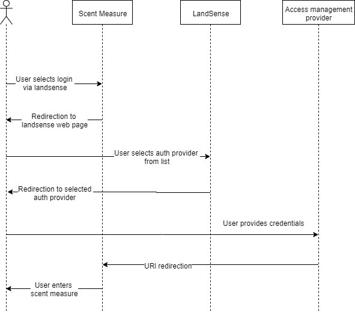
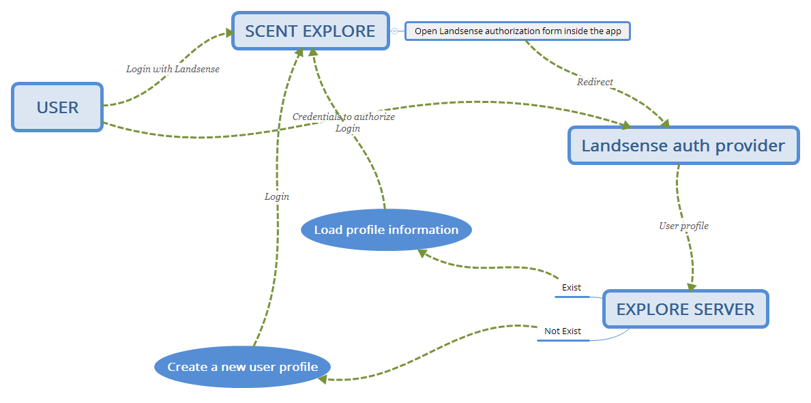

[appendix]
[[Scent-Landsense]]
= Integration between SCENT & LandSense

.[big]*A.1 Introduction*

During the past few years, a variety of citizen-science tools have been implemented aiming to enable citizens and relevant associations and groups to be involved and engaged with environmental monitoring. The scope and functionalities of such tools may vary, ranging from mobile applications enabling collection and semantic annotation of multimedia and communication with portable sensors to visualization engines and content creation and campaign configuration applications.

One of the scopes of this activity is to demonstrate interoperability and integration between implemented processes of authentication and authorization. In particular, three applications developed within the H2020 SCENT Citizen Observatory project: the visualization site of SCENT Harmonization platform, SCENT Explore, and SCENT Measure are integrated with an authorization server implemented by H2020 LandSense Citizen Observatory. Thus, this chapter aims to showcase both the results arising from this process as well as to constitute a guide aiming primarily to assist integration of existing citizen-science applications with LandSense authorization server or even to replicate this process within their own infrastructure.

.[big]*A.2 Setting the scene*

Authorization depends on, but is rather separated from, authentication. The first term refers to the process of deciding whether an application should be allowed to conduct an operation following the receipt of a request by the user, whilst the second refers to determining the identity of the user or program sending that request. A characteristic of an authentication mechanism constitutes the Single Sign On (SSO), that relates to the user’s identity being used to provide access across multiple systems (i.e., services, applications). SSO allows a single authentication process (managed by a single Identity Provider, or other authentication mechanism) to be used across multiple systems within a single organization or across multiple organizations (i.e., common login credentials across systems). Last but not least, establishing a federation involves the management and mapping of user identities between Identity Providers across organizations (and security domains) via trust relationships.
In the context of this experiment, the following paradigms (use cases) were assessed:

* having different systems across multiple organizations (projects) trusting/connecting to a single third-party Identity Provider; and

* having different Identity Providers across different projects trusted by a single system.

[#img-SCENT-LANDSENSE-INTEGRATION,reftext='{figure-caption} {counter:figure-num}']]
.Architectural overview of integration between SCENT applications and LandSense authorisation server
image::images/SCENTLANDSENSEINTEGRATION.png[Scent-LandSense]

.[big]*A.3 SCENT Harmonisation Platform visualization site*

The SCENT Harmonisation platform visualization site constitutes a single page web application written in JavaScript. To achieve integration with LandSense authorization server, the ‘implicit grant’ modality of OAuth2 protocol is implemented. The reason for using Implicit Grant Type is because the Harmonisation Platform (and any front-end javascript application) cannot guarantee the client secret confidentiality (which is essential for the other OAuth2 flows).  Following the user log in, the access_token is issued immediately allowing users to access and use protected resources and operations. In addition to the access token, an ID token is also issued from the Authorization Server. The ID token takes the form of a JWT (JSON Web Token) which is a JSON payload that is signed with the private key of the issuer (LandSense Identity Manager) and can be parsed by the Harmonisation Platform. Inside the JWT (ID token), there are a handful of defined property names that provide information to the application (e.g., the Harmonisation Platform). This information includes a unique identifier for the user, the identifier for the server that issued the token, the identifier for the client that requested the token, etc. But the information also includes some user attributes (email, name, etc.) so that the client (e.g., Harmonisation Platform) is able to display the user information in the navigation bar.

[#img-implicit-grant,reftext='{figure-caption} {counter:figure-num}']]
.Architectural overview of integration between SCENT applications and LandSense authorisation server
image::images/implicitgrant.jpg[implicit-grant]

One scenario involves the following main steps as displayed in the image above.

* The first step involves an interaction of the user with the web-browser (i.e., choosing to log in) upon which the client generates and sends a login request to the authorization server (i.e., LandSense authorization server, in our case). The request is sent in the form of a HTTP request and the information is sent as URL query parameters. More specifically, the following parameters are specified during the request:

-	client_id: A publicly exposed string that is used by the service API to identify the application;

-	redirect_uri: The location where the service will redirect the user after they authorise (or deny) the application (i.e., Harmonisation Platform) and therefore the part of the application that will handle access and ID tokens;

-	scope: specifying the level of access that the application is requesting; and

- response_type: In this flow, the value is “id_token,” which means that a successful response must include both an access token and an ID token.

The configuration file that was created is provided below.

[source,xml]
----
    export const oidcSettings = {
      authority:   'https://as.landsense.eu',
      clientId:       '<my_client_id_>',
      redirectUri: 'https://scent-harm.iccs.gr/oidc-callback',
      responseType: 'id_token',
      scope: 'openid profile email landsense birdlife',
      end_session_endpoint: 'https://as.landsense.eu/oauth/revoke'
      }
----
The aforementioned configuration file has been used by the library vuex-oidc (url: https://github.com/perarnborg/vuex-oidc, License: MIT). Vuex-oidc library has been integrated with the Harmonisation Platform in order to implement the Oauth2 implicit workflow.

* In what follows, the authorisation server checks the request, and if it is valid, it presents to the user the login form.

* The user inserts his/her credential by selecting one of the systems registered to the LandSense authentication server. Following the conclusion of this process, the access and ID tokens are sent to the SCENT Harmonisation visualization site and the user is automatically transferred back to the application.

.[big]*A.4 SCENT Measure*
Scent Measure is a mobile application that works in tandem with a portable smart sensor (Xiaomi International Version Flower Care Smart Monitor), connected to the user’s mobile device intended to measure soil conditions. The application is available for Android versions newer that 4.3 Jelly Bean, requires devices with Bluetooth version greater than 4.1, and offers a maximum measurement update frequency of 15 seconds.

The section below describes the process from the integration of SCENT Measure with LandSense authorization server, while also constituting a guide that can facilitate integration of any android application with Identity Management System that adopt the OAuth2 protocol.

.A.4.1 Integration with LandSense: Guide for Android applications

In order to enable login in to your application with Landsense you will have to implement the openid connect authentication code flow. In order to speed-up the development process you can use (AppAuth) which is publicly available and documented in the following link.

[source,ini]
----
https://appauth.io/
----
You can import AppAuth by using the following dependency in your build.gradle file.

[source,ini]
----
implementation 'net.openid:appauth:0.7.1'
----
Now you are ready to use app-auth’s classes in order to implement your authentication flow. Initially you will have to create an authentication service configuration according to details provided by Landsense’s configuration web page available at the following URl.

[source,ini]
----
https://as.landsense.eu/.well-known/openid-configuration
----

The configuration requires Landsense’s authorize and token endpoints.

[source,xml]
----
AuthorizationServiceConfiguration serviceConfig =
    new AuthorizationServiceConfiguration(
            Uri.parse("https://as.landsense.eu/oauth/authorize"), // authorization endpoint
            Uri.parse("https://as.landsense.eu/oauth/token"));
----

Next the client application’s specific details must be provided in preparation of the authorization request. The following client application specific details are required:

 *	Client application id

 *	Redirection URL

You can find these details within the dedicated Landsense configuration page available for your application.

[source,ini]
----
AuthorizationRequest.Builder authRequestBuilder =
        new AuthorizationRequest.Builder(
                serviceConfig, // the authorization service configuration
                "XXXXXXXXXXXXXXX@as.landsense.eu", // the client ID, typically pre-registered and static
                ResponseTypeValues.CODE, // the response_type value: we want a code
                Uri.parse("com.example.application:/callback")); // the redirect URI to which the auth response is sent
----

Finally, you can build your request and then directly indicate the activities required upon successful and non-successful authentication.

[source,ini]
----
AuthorizationRequest authRequest = authRequestBuilder.build();

AuthorizationService authService = new AuthorizationService(this);

authService.performAuthorizationRequest(
        authRequest,
        PendingIntent.getActivity(this, 0, new Intent(this, FullscreenActivity.class), 0), //Auth succesfull activity
        PendingIntent.getActivity(this, 0, new Intent(this, LoginActivity.class), 0)); //Auth failure activity
----

You will be able to handle the auth response within the invoked activities as follows:

[source,ini]
----
AuthorizationResponse resp = AuthorizationResponse.fromIntent(getIntent());
  AuthorizationException ex = AuthorizationException.fromIntent(getIntent());
----

Another important aspect required by AppAuth is capturing the authorization redirect. You can configure all redirects through a manifext placeholder io your application’s build.gradle file as follows:

[source,ini]
----
manifestPlaceholders = [
        'appAuthRedirectScheme': com.example.application :/callback'
]
----

and  by adding an intent-filter for AppAuth's RedirectUriReceiverActivity to your AndroidManifest.xml:

[source,xml]
----
<activity
    android:name="net.openid.appauth.RedirectUriReceiverActivity"
    tools:node="replace">
    <intent-filter>
        <action android:name="android.intent.action.VIEW"/>
        <category android:name="android.intent.category.DEFAULT"/>
        <category android:name="android.intent.category.BROWSABLE"/>
        <data android:scheme="com.example.application"/>
    </intent-filter>
</activity>
----

Following this, you can now login to your application through LandSense.
The following diagram summarizes the process as perceived by Scent Measure’s users:

[#img-Measure-Login,reftext='{figure-caption} {counter:figure-num}']]
.Login sequence diagram for Scent Measure

.[big]*A.5 Scent Explore*

Scent Explore is a mobile application for crowdsourcing that allows users to take pictures while walking around specific geographic areas - points of interest (PoIs). The application exploits some gamification mechanics such us points and badges to engage users. Explore is an Alternate Reality Gaming (ARG) app related to an Authoring tool which generates and visualizes the PoIs on the map. When approaching a point of interest, the application activates the camera and shows an Augmented reality entity to be captured simply by tapping on the screen while taking a picture of the area.

The user will then be asked to annotate (tag) the picture. To accurately define the position of the PoI, apart from capturing the location through GPS, the application uses also the gyroscope (if available) for the direction, while also integrating these values with the compass information. The app enables the collection of both pictures and videos for land cover / land use and river parameters (water level & velocity) monitoring, respectively.

In Scent Explore the users' registrations are managed by a dedicated server, which also manages all users' scores for gamification. This system is not suitable for using external authorization systems. To overcome this problem, the authorization with LandSense is managed by the application server. The process/steps implemented are described as follows:

1.  The user runs SCENT Explore;

2.	The user selects login via LandSense;

3.	Scent Explore open the login page inside the app (webView for Android and WKWebView in iOS ): this is mandatory in iOS;

4.	The user selects the auth provider from the list;

5.	LandSense redirects to the selected auth provider;

6.	The user provides credentials;

7.	URL redirection to Explore server;

8.	The Explore Server checks if a SCENT Explore profile exist;

9.	If the profile exists, upload the profile information to SCENT Explore;

10.	If the profile does not exist, create a new user profile; and

11.	Login.

[#img-Explore-Login,reftext='{figure-caption} {counter:figure-num}']]
.Login sequence diagram for Scent Explore

In this example we will use C# code for Unity3D. You need to use a webview, possibly cross-platform, before each call, and you should also destroy the old webview to clear the cache:

[source,ini]
----
if ( UniWebView != null )
	Destroy(UniWebView);
----

To add the webview in the scene, use the gameObject method:

[source,ini]
----
UniWebView = gameObject.AddComponent<UniWebView>();
----

and add the callback to the webview:

  UniWebView.OnPageFinished += OnPageFinished;

Remember to remove also the callback before destroying the webview:

  UniWebView.OnPageFinished -= OnPageFinished;

In order to improve the UI, it is suggested to not immediately show the webview. In many cases the mobile connection is slow; thus it is preferable to wait for the web page to be fully loaded before showing the webview.

As a next step, open the login page inside the app:

[source,ini]
----
UniWebView.Load("https://example.com/landsense.php&code=yourprivatecode");
----

In the php file it is advisable to insert a secret key to protect against possible intrusions.
In the landsense.php file insert the code to open the login page of landsense:

[source,ini]
----
https://as.landsense.eu/oauth/authorize/openid?client_id=".$CLIENT_ID."&response_type=code&state=yourstate&grant_type=authorization_code&scope=openid profile email
----

* $CLIENT_ID = the CLIENT_ID code  of your register app in landsense
* STATE = a your code to verify the Redirection authenticity

If your Landsense login is successful, you will be redirected to the indicated URL. The URL receives the code for the Authorization Bearer method and the state inserted in the call as an additional verification of authenticity.
The code below is used to receive the access token and to be able to use the bees to retrieve the data of the logged user.

[source,ini]
----
	$code = $_GET['code'];
    	$state= $_GET['state'];
	$ch = curl_init();
	curl_setopt_array($ch, array(
    	CURLOPT_RETURNTRANSFER => 1,
    	CURLOPT_URL => 'https://as.landsense.eu/oauth/token',
    	CURLOPT_HEADER => 0,
	CURLOPT_POST => 1,
    	CURLOPT_HTTPHEADER => array('Authorization: Bearer '.$code),
 	CURLOPT_POSTFIELDS =>  array(
                	'grant_type' => 'authorization_code',
                	'client_id' => $CLIENT_ID,
                	'client_secret' => $CLIENT_SECRET,
                	'scope' => 'openid profile email',
                	'code' => $code )
	));

	$result = curl_exec($ch);
----

The code below is used to receive the user's info and check if the user already has an account on the Explore management server or if a new account needs to be created.
[source,ini]
----
	$ch = curl_init();

	curl_setopt_array($ch, array(
    	CURLOPT_RETURNTRANSFER => 1,
    	CURLOPT_URL => 'https://as.landsense.eu/oauth/userinfo?client_id='.$CLIENT_ID.'&client_secret='.$CLIENT_SECRET,
    	CURLOPT_HEADER => 0,
    	CURLOPT_POST => 1,
CURLOPT_POSTFIELDS =>  'client_id='.$CLIENT_ID.'&client_secret='.$CLIENT_SECRET,
    	CURLOPT_HTTPHEADER => array('Authorization: Bearer '.$usertoken["access_token"],
	'Content-Type:application/x-www-form-urlencoded' ),
	));

	$result = curl_exec($ch);
	echo "landsenseloginok:".$result;
----

“landsenseloginok:” is a keyword, which is used by the application to understand that Landsense has given permission and that user data is transmitted.

[source,ini]
----
void OnPageFinished(UniWebView webView, int statusCode, string url)
{

	webView.GetHTMLContent((content)=>{

		if ( content.Contains(“landsenseloginok:”) )
		{
			//elaborate the json value
		}
	});
}
----

If the json is correct, a specific php page is called in the user management server to check if the user has an account or if a new account needs to be created.

[source,ini]
----
	$ch = curl_init();

    	curl_setopt_array($ch, array(
    	CURLOPT_RETURNTRANSFER => 1,
    	CURLOPT_URL => "https://www.yourserver.com/api/user/generate_auth_cookie/?username=".$username."&password=".$password,
    	CURLOPT_HEADER => 0,
    CURLOPT_POST => 0,
	));

	$result = curl_exec($ch);

	//json decode
	$login = json_decode( $result, true );

	curl_close( $ch);

	//status check
	if ( strcmp($login['status'],"ok") == 0 )
	{
    		echo "scentexploreresult:".$result;
    		exit();
	}
----
if the status is “ok” the user has an account otherwise you have to create an account via the API.
