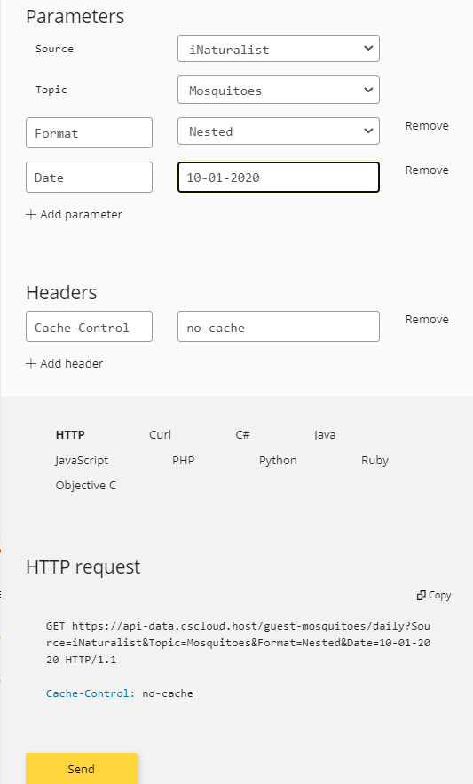

[[APIProliferation]]
== API proliferation
=== What is a API
In this document the term API refers to the concept of "server side Web REST API" understood as a programmatic interface consisting of one or more publicly exposed URI endpoints using the HTTP defined request–response message system (e.g. HTTP GET or HTTP POST), that typically exchange  resources (payload) represented in JSON, XML or HTML via the web. HTML representations are presented to the users that interact with the (e.g following links) and JSON or XML representations are reserved to machines that will be able parse and create them.

The API should be well documented in a way that, for each URL representing a resource, the HTTP verbs used as well as the representation (JOSN, XML or HTML payloads) of the request and response are well specified. The documentation can take several forms (commonly presented in HTML) but, recently, the OpenAPI documentation format (JSON or YAML) has been well accepted by the community as can be interpreted by machines as well as transformed into HTML for humans consumption.

The following sub chapters collect some of the APIs we have encountered that are used in citizen science.

=== iNaturalist APIs
The iNaturalist APIs allow an application to act as a user and manage observations in their name. In practice, the existence of the API expands the way a user can create and manage observations. Possible approaches are:

* The HTML pages that the iNaturalist website
* The iNaturalist app for mobile devices
* Other client applications developed by 3rt parties that send the data to the iNAturalist servers using the APIs.

The APIs are meant to be used for building applications and for fetching small to medium batches of data. It is not meant to be a way to download data in bulk. Currently iNaturalist has two APIS. The https://www.inaturalist.org/pages/api+recommended+practices[iNaturalist API Recommended Practices] gives an overview of the current situation with iNaturalist:

* An old API that has been offered through the website for a long time and it is documented at https://www.inaturalist.org/pages/api+reference. The development of this API has stopped but is still operational.
* A newer API at https://api.inaturalist.org/, which was designed to be more consistent and comprehensive with faster response times. The new API is more scalable and will be used as the bases for future developments. Most importantly for developers, the new API declare correctly in the headers what is necessary to make a JavaScript application that supports Cross-origin Resource Sharing (CORS). Without this headers, the RitmeNatura JavaScript code is not allowed to read the response of the API requests.

Despite the fact that iNaturalist recommends using the new API and is considering the old one as deprecated, there are several things that justify the permanence of the old API:

* The pages generated in the iNaturalist website, are HTML representations of the old API. This makes the old API ideal for getting machine readable data and comparing it with the equivalent HTML page.
* There are no OAuth authentication endpoints in the new API and you are expected to use the old API to get authenticated simultaneously in both APIs.
* The way to send and image to the API might be rudimentary in the old API but it is very convenient.

During the course of this Interoperability Experiment, a JavaScript application was developed to facilitate the contributions of users in the RitmeNatura initiative and the Phenotandem project. In this application, the species observed are limited to an short list of species that are of phenological interest because they are easy to recognize. The application is capable to send an observation in real time to iNaturalist of the selected species, to send pictures of it and to add the phenological status as a additional field. The application simplifies the data capturing process because the possible phenological status of the plant depends on the observed species and the application guides the user to the right available phenological status.

The JavaScript application can be found in the https://www.ritmenatura.cat/captura/index.htm[RitmeNatura capture page[]. First the application uses the hello.js library to login into iNaturalist (see <<img_Ritme-Natura-Login>>). Once users have selected their pictures, species name, phenophase name, position and time (see <<img_Ritme-Natura-Observation>>), the information is sent to the iNaturalits in the following order:

* The "https://api.inaturalist.org/v1/observations.json of the new API endpoint is used to send the observed species, position and time. This endpoint is supposed to return the id of the created observation but unfortunately not always does that, what complicates a bit the code.
* The "https://www.inaturalist.org/observations/{userName}.json?updated_since={almost_now} endpoinf of the old API is used to retrieve that last recorded observation id if not returned by the creation event.
* The https://api.inaturalist.org/v1/project_observations.json?project_observation[project_id]=63554&project_observation[observation_id]={id} is used to associate the observation to the RitmeNatura project (there is no way to do this during the creation);
* The https://api.inaturalist.org/v1/observation_photos endpoint is used to send a multipart form with the observation id and a picture binary data for each of the photos created.

The following illustrations show how the user interface prepare the interface to send the Observations and how it finally does that.

[#img_Ritme-Natura-Login,reftext='{figure-caption} {counter:figure-num}']
.RitmeNatura Login interface
image::images/RitmeNaturaLogin.png[Ritme Natura Login]

[#img_Ritme-Natura-Observation,reftext='{figure-caption} {counter:figure-num}']
.RitmeNatura Observation interface
image::images/RitmeNaturaObservation.png[RitmeNatura Observation]

[#img_Ritme-Natura-Sending,reftext='{figure-caption} {counter:figure-num}']
.RitmeNatura Observation in the process of being sent. The id of the observations is already know at this stage.
image::images/RitmeNaturaSending.png[RitmeNatura Sending]

[#img_Ritme-Natura-Sent,reftext='{figure-caption} {counter:figure-num}']
.RitmeNatura Observation is completely sent.

==== Twitter API to improve dissemination.

The proliferation of APIs is particularly perceivable in the social media portals. The big players provide several APIs that can make our observations more visible. In our case, we followed the instructions of twitter to build a link that sends the observation details to our twitter followers, when, as a users we sent the observations to iNaturalist first: https://developer.twitter.com/en/docs/twitter-for-websites/tweet-button/overview

[#img_Ritme-Natura-Tweet,reftext='{figure-caption} {counter:figure-num}']
.RitmeNatura using the twitter API to further disseminate the observation.

There are several social media common used portals and almost all provide a small API to create messages. Unfortunately non of them are equal requiring several developing efforts to cover all of them. Some times the social media player deprecates a version of the API forcing to maintain the code from time to time. One possible solution is to use a 3rt party library to connect with as many social media players as possible. https://wcoder.github.io/share-buttons/ is only one example. The following illustration is a visual prove of the proliferation of different APIs.

[#img_Share-Buttons,reftext='{figure-caption} {counter:figure-num}']
.Share buttons library

=== API Sensor Community
The data from this initiative is accessible via an FTP like services that offers every day data from 2015: http://archive.sensor.community/. However, the data fomr Sensor Community is also offered in multiple APIs that are described in https://github.com/opendata-stuttgart/meta/wiki/EN-APIs[GitHub]. some of them are described below.

==== API for presenting maps
This is a very simple rest API that responds with a map browser interface based on leaflet that uses the following URL template:

https://maps.sensor.community/#{zoom}/{lat}/{lon}

[#img_Sensor-Community-Maps,reftext='{figure-caption} {counter:figure-num}']
.Sensor.Community Map example

==== API for disseminating data collected by sensors (read)
There are two version of them v1 and v2. Both servers allow for getting the data of the last 5 minutes (as a list or as an average). While v1 provides a flexible query interface, v2 provides direct endpoints to the average data of the last hour or the last 24 hours.

[#table-sensor-community-api,reftext='{table-caption} {counter:table-num}']
.Sensor community API endpoints
[width = "100%",options="header"]
|===
| Endpoint | Usage
| https://data.sensor.community/static/v1/data.json | all measurements of the last 5 minutes for all sensors.
| https://data.sensor.community/static/v2/data.json | average of all measurements per sensor of the last 5 minutes for all sensors.
| https://api.luftdaten.info/static/v2/data.dust.min.json | same as data.json but dust sensors only
| https://api.luftdaten.info/static/v2/data.temp.min.json | same as data.json but temp./humidity/air pressure sensors only
| https://data.sensor.community/static/v2/data.1h.json | average of all measurements per sensor of the last hour
| https://data.sensor.community/static/v2/data.24h.json | average of all measurements per sensor of the 24 hours
| https://data.sensor.community/airrohr/v1/sensor/{apiID}/ | all measurements of the last 5 minutes for the sensor with apiID
| https://data.sensor.community/airrohr/v1/filter/{query} | all measurements of the last 5 minutes filtered by query. See the table below for the parameters of the query.
|===

[#table-sensor-community-api,reftext='{table-caption} {counter:table-num}']
.Parameters of the query for the https://data.sensor.community/airrohr/v1/filter/ endpoint
[width = "100%",options="header"]
|===
| Parameter | Value  format | Description | Example
| type | {sensor type} | comma-separated list of sensor types | SDS011,BME280
| area | {lat,lon,distance} | all sensors within a max radius | 52.5200,13.4050,10 (Berlin)
| box | {lat1,lon1,lat2,lon2} | all sensors in a 'box' with the given coordinates | 52.1,13.0,53.5,13.5
| country | {country code} | comma-separated list of country codes | BE,DE,NL
|===

The data retrieved does not follow any particular format despite the fact that it has locations that could be specified in GeoJSON or observations providing many of the values that the Sensor Things API supports. It could be easy to create a mapping between STA data model.

[source,json]
.Example of the first point responded by https://data.sensor.community/static/v2/data.24h.json
----
{
	"id": 4200027061,
	"sampling_rate": null,
	"timestamp": "2021-03-10 13:00:39",
	"location": {
		"id": 19,
		"latitude": "48.722",
		"longitude": "9.21",
		"altitude": "413.2",
		"country": "DE",
		"exact_location": 0,
		"indoor": 0
	},
	"sensor": {
		"id": 48,
		"pin": "5",
		"sensor_type": {
			"id": 1,
			"name": "PPD42NS",
			"manufacturer": "Shinyei"
		}
	},
	"sensordatavalues": [
		{
			"id": 9132404843,
			"value": "5786181.49",
			"value_type": "durP1"
		},
		{
			"id": 9132404846,
			"value": "1324941.79",
			"value_type": "durP2"
		}
	]
},
{
	"id": 4218315281,
	"sampling_rate": null,
	"timestamp": "2021-03-11 18:30:34",
	"location": {
		"id": 19,
		"latitude": "48.722",
		"longitude": "9.21",
		"altitude": "413.2",
		"country": "DE",
		"exact_location": 0,
		"indoor": 0
	},
	"sensor": {
		"id": 48,
		"pin": "5",
		"sensor_type": {
			"id": 1,
			"name": "PPD42NS",
			"manufacturer": "Shinyei"
		}
	},
	"sensordatavalues": [ {
		"id": 9172750139,
		"value": "87.60",
		"value_type": "humidity"
	} ]
},

----

The STA standard provides a why to describe the sensor but more importantly the variable (observation type) that is being measured, no only in terms of units of measure but the actual meaning of the variable. In this snipped of the data, there is not enough information to understand that was measured in id=4200027061, and what the you two numbers associated with the "value" tag actually means without having to manually look for extra information. In the id=4218315281 we know that humidity was measured but we have to assume (or imagine) that 87.60 is a relative humidity (as there are no units of measure).

==== API for pushing data form the sensors into the API (write)
There is also a API to include information acquired by the sensors into the database to make it available. This API is available at this endpoint https://api.sensor.community/v1/push-sensor-data but it will not be described here.

=== USA Citizen Science Cloud Data Portal
In the Citizen Science Cloud Data Portal users can access data sets from various citizen science projects around the world.  These data sets have been transformed and aligned to our common data schema that is deeply based on the OGC O&M so they are interoperable with one another. The aim is to make citizen science data reusable,

The site exposes Citizen Science APIs about 4 topics: Air,
Insects, Pollution and other Sensors. This topics contain data from: Bees (from iNaturalist and the Earth Challenge Insect app), Mosquitoes (from iNaturalist, Mosquito Alert, and GLOBE Observer Mosquito Habitat Mapper), Particulate Matter (from Purple Air, Sensor.Community, and EPA's AirNow), Plastics (from  NOAA's MDMAP, EEA's MLW, and Ocean Conservancy's TIDES) and some other measurement done in the Earth Challenge mobile application (air quality, plastic pollution, insect populations, and food security).

All data is available from this page that describe the APIS and makes it utilization easy: https://portal-data.cscloud.host/

[#img_CitSci-Cloud-Data-Portal-Home,reftext='{figure-caption} {counter:figure-num}']
.Citizen Science Cloud Data Portal

This page offers access to an API that allows retrieving the data. We will focus on retrieving data from mosquito observations registered in a particular date: https://portal-data.cscloud.host/api-details#api=mosquitoes&operation=get-daily

[#img_CitSci-Cloud-Data-Portal-Mosquito,reftext='{figure-caption} {counter:figure-num}']
.Mosquito data API offered in the Citizen Science Cloud Data Portal

This page offer both a human readable version of the API description of the API (shown in <<img_CitSci-Cloud-Data-Portal-Mosquito>>) as well as Machine readable OpenAPI shuch as the one shown bellow

[source,json]
.Example of an API description for mosquitos in OpenAPI 3.0
----
{
    "openapi": "3.0.1",
    "info": {
        "title": "Mosquitoes",
        "description": "Data on species occurrence from iNaturalist, Mosquito Alert, and GLOBE Observer Mosquito Habitat Mapper. ",
        "version": "1.0"
    },
    "servers": [
        {
            "url": "https://api-data.cscloud.host/mosquitoes"
        }
    ],
    "paths": {
        "/daily": {
            "get": {
                "summary": "daily",
                "operationId": "get-daily",
                "parameters": [
                    {
                        "name": "Source",
                        "in": "query",
                        "description": "REQUIRED: Choose a source - {iNaturalist} - Coming Soon {MosquitoAlert, GLOBE}",
                        "required": true,
                        "schema": {
                            "enum": [
                                "iNaturalist"
                            ],
                            "type": "string"
                        }
                    },
                    {
                        "name": "Topic",
                        "in": "query",
                        "description": "REQUIRED: Predefined Topic - {Mosquitoes}",
                        "required": true,
                        "schema": {
                            "enum": [
                                "Mosquitoes"
                            ],
                            "type": "string"
                        }
                    },
                    {
                        "name": "Format",
                        "in": "query",
                        "description": "OPTIONAL: Choose a format - {Flat, Nested, csv}",
                        "schema": {
                            "enum": [
                                "Flat",
                                "Nested",
                                "CSV"
                            ],
                            "type": "string"
                        }
                    },
                    {
                        "name": "Date",
                        "in": "query",
                        "description": "OPTIONAL: Choose a date when data was uploaded into the system - use format {mm-dd-yyyy} (Note: the date does not refer to the data of observation)",
                        "schema": {
                            "type": "date"
                        }
                    }
                ],
                "responses": {
                    "200": {
                        "description": "response in a format and content depending on the request"
                    }
                }
            }
        }
    }
}
----

The endpoint of the API has this format: https://api-data.cscloud.host/mosquitoes/daily?Source={source}&Topic={topic}&Format={format}&Date={date}

[#table-CitSci-Cloud-Data-Portal-Mosquito,reftext='{table-caption} {counter:table-num}']
.CitSci Cloud Data Portal Mosquito API definition
[width = "100%",options="header"]
|===
| Name | In | Required | Type | Description
| Source | query | true | string | REQUIRED: Choose a source - {iNaturalist} - Coming Soon {MosquitoAlert, GLOBE}
| Topic | query | true | string | REQUIRED: Predefined Topic - {Mosquitoes}
| Format | query | false | string | OPTIONAL: Choose a format - {Flat, Nested, csv}
| Date | query | false | Date | OPTIONAL: Choose a date when data was uploaded into the system - use format {mm-dd-yyyy} (Note: the date does not refer to the data of observation)
|===

[#img_CitSci-Cloud-Data-Portal-TryIt,reftext='{figure-caption} {counter:figure-num}']
.Mosquito data API trial interface offered in the Citizen Science Cloud Data Portal

The test interface results in the creation of this request: https://api-data.cscloud.host/guest-mosquitoes/daily?Source=iNaturalist&Topic=Mosquitoes&Format=Nested&Date=10-01-2020

The response is an array of observation. The first one corresponds to Culicidae mosquito seen in Sugarloaf Mountain Park, Nanaimo, BC, CA.

[source,json]
.Example of a single observation of a mosquito returned by the API
----
{
	"title": "iNaturalist Data - Mosquitoe",
	"description": "Data is generated from the iNaturalist database filtered by Mosquitoe",
	"dataStream_name": "2852680 - species occurrence",
	"dataStream_description": "All observations from a particular user taken with a sensor or manually",
	"dataStream_observationType": "category observation|truth observation",
	"observation_projectObservationUID": 2852680,
	"observation_resultTruthObservation_phenomenonTime": 1601475087000,
	"observation_resultTruthObservation_resultTime": 1601505507000,
	"observation_resultTruthObservation_result": "TRUE",
	"observation_resultTruthObservation_submitTime": 1601505497000,
	"observation_resultCategoryObservation_phenomenonTime": 1601475087000,
	"observation_resultCategoryObservation_resultTime": 1601505507000,
	"observation_resultCategoryObservation_result": "Culicidae",
	"observation_resultCategoryObservation_submitTime": 1601505497000,
	"observation_image_imageStatus": "TRUE",
	"observation_image_imageResult": "https://static.inaturalist.org/photos/98153798/original.jpg?1601505501",
	"observation_context_parameters": {
		"captive_cultivated": "False",
		"time_zone": "America/Los_Angeles",
		"url": "https://www.inaturalist.org/observations/61345087",
		"species_guess": "None",
		"scientific_name": "Culicidae",
		"common_name": "Mosquitoes",
		"iconic_taxon_name": "Insecta"
	},
	"observation_context_parameters_array_captiveCultivated": "False",
	"observation_context_parameters_array_timeZone": "America/Los_Angeles",
	"observation_context_parameters_array_url": "https://www.inaturalist.org/observations/61345087",
	"observation_context_parameters_array_soundUrl": null,
	"observation_context_parameters_array_tagList": null,
	"observation_context_parameters_array_description": null,
	"observation_context_parameters_array_speciesGuess": "None",
	"observation_context_parameters_array_scientificName": "Culicidae",
	"observation_context_parameters_array_comonName": "Mosquitoes",
	"observation_context_parameters_array_iconTaxonName": "Insecta",
	"omProcess_license_licenseName": "cc-by-nc",
	"omProcess_license_licenseAttributionAggregator": "iNaturalist",
	"omProcess_license_licenseAttributionSource": "angusbc",
	"omProcess_processType": "sensor",
	"omProcess_processReference": "https://www.inaturalist.org/pages/help",
	"omProcess_processSource": {

	},
	"omProcess_processSource_array_positioningMethod": null,
	"omProcess_processSource_array_positioningDevice": null,
	"omProcess_processSource_array_oathApplicationId": null,
	"omProcess_resultQuality_validationStatus": "TRUE",
	"omProcess_resultQuality_validationMethod": "human validation",
	"omProcess_resultQuality_validationResult": "TRUE",
	"omProcess_resultQuality_qualityGrade": "needs_id",
	"omProcess_resultQuality_assessment": {
		"quality_grade": "needs_id",
		"taxonFlagCountResolved": 0,
		"taxonFlagCountUnresolved": 0,
		"positional_accuracy": 47
	},
	"omProcess_resultQuality_assessment_array_taxonFlagCountResolved": 0,
	"omProcess_resultQuality_assessment_array_taxonFlagCountUnresolved": 0,
	"omProcess_resultQuality_assessment_array_positionalAccuracy": 47,
	"observedProperty_name": "Species occurrence",
	"observedProperty_description": "Whether a species is observed at a location",
	"observedProperty_definition": "https://www.sciencedirect.com/topics/earth-and-planetary-sciences/species-occurrence",
	"sensor_name": "angusbc",
	"sensor_description": "Observation taken by user: angusbc",
	"sensor_encodingType": "Varies",
	"location_name": "anonymous location",
	"location_description": "geoprivacy:False",
	"location_encodingType": "GeoJSON",
	"location_locationDetails_mobileProperties_latitude": 49.2086861508,
	"location_locationDetails_mobileProperties_longitude": -123.9700827371,
	"location_locationDetails_mobileProperties_locationParameters": {
		"geoprivacy": "False",
		"taxon_geoprivacy": "None",
		"place_guess": "Sugarloaf Mountain Park, Nanaimo, BC, CA"
	},
	"location_locationDetails_mobileProperties_locationParameters_array_geoprivacy": "False",
	"location_locationDetails_mobileProperties_locationParameters_array_taxonGeoprivacy": "None",
	"location_locationDetails_mobileProperties_locationParameters_arrays_coordinatesObscured": null,
	"location_locationDetails_mobileProperties_locationParameters_arrays_placeGuess": "Sugarloaf Mountain Park, Nanaimo, BC, CA",
	"thing_name": "angusbc",
	"thing_description": "iNaturalist user information",
	"thing_properties": {
		"species_guess": "None",
		"scientific_name": "Culicidae",
		"iconic_taxon_name": "Insecta"
	},
	"featureOfInterest_name": "Mosquitoes",
	"featureOfInterest_description": "anonymous location",
	"featureOfInterest_encodingType": "GeoJSON",
	"featureOfInterest_location": "location_locationDetails_stationaryProperties_latitude|location_locationDetails_stationaryProperties_longitude",
	"custom_agol_viz_taxonId": 52134,
	"custom_agol_viz_taxonGenusName": "Culicidae",
	"custom_agol_viz_taxonViz": "Other",
	"custom_ec_schema": "OGC Sensor Thing: iNaturalist - Mosquitoes v1.4",
	"ETL_TIMESTAMP": 1601510239089
}
----

The observation was extracted from the iNaturalist from the record https://www.inaturalist.org/observations/61345087.

[#img_CitSci-Cloud-Data-Portal-iNat,reftext='{figure-caption} {counter:figure-num}']
.The same Mosquito retrieved by the API seen in the iNAturalist portal.

iNaturalist represents the same observation in json in a completelly different way (https://www.inaturalist.org/observations/61345087.json). If you consider the previous representation verbose, the original one is even lengthier.

[source,json]
.Fragment of a single observation of a mosquito returned by the iNaturalist (simplified)
----
{
	"id": 61345087,
	"observed_on": "2020-09-30",
	"description": null,
	"latitude": "49.2086861508",
	"longitude": "-123.9700827371",
	"map_scale": null,
	"timeframe": null,
	"species_guess": "Mosquitoes",
	"user_id": 2852680,
	"taxon_id": 357355,
	"created_at": "2020-09-30T22:38:17.626Z",
	"updated_at": "2020-11-05T21:38:46.405Z",
	"place_guess": "Sugarloaf Mountain Park, Nanaimo, BC, CA",
	"id_please": false,
	"observed_on_string": "Wed Sep 30 2020 07:11:27 GMT-0700 (PDT)",
	"iconic_taxon_id": 47158,
	"num_identification_agreements": 1,
	"num_identification_disagreements": 0,
	"time_observed_at": "2020-09-30T14:11:27.000Z",
	"time_zone": "Pacific Time (US \u0026 Canada)",
	"location_is_exact": false,
	"delta": false,
	"positional_accuracy": 47,
	"private_latitude": null,
	"private_longitude": null,
	"geoprivacy": null,
	"quality_grade": "needs_id",
	"positioning_method": null,
	"positioning_device": null,
	"out_of_range": null,
	"license": "CC-BY-NC",
	"uri": "https://www.inaturalist.org/observations/61345087",
	"observation_photos_count": 2,
	"comments_count": 0,
	"zic_time_zone": "America/Los_Angeles",
	"oauth_application_id": 3,
	"observation_sounds_count": 0,
	"identifications_count": 3,
	"captive": false,
	"community_taxon_id": 52134,
	"site_id": 1,
	"old_uuid": null,
	"public_positional_accuracy": 47,
	"mappable": true,
	"cached_votes_total": 0,
	"last_indexed_at": "2020-12-28T13:28:17.397Z",
	"private_place_guess": null,
	"uuid": "b6f99a3f-6ff4-4d3b-b80b-88a7491af298",
	"taxon_geoprivacy": null,
	"user_login": "angusbc",
	"iconic_taxon_name": "Insecta",
	"captive_flag": false,
	"created_at_utc": "2020-09-30T22:38:17.626Z",
	"updated_at_utc": "2020-11-05T21:38:46.405Z",
	"time_observed_at_utc": "2020-09-30T14:11:27.000Z",
	"faves_count": 0,
	"owners_identification_from_vision": true,
	"user": {
		"id": 2852680,
		"login": "angusbc",
		"name": null,
		"observations_count": 2373,
		"identifications_count": 0,
		"user_icon_url": "https://static.inaturalist.org/attachments/users/icons/2852680/thumb.jpg?1587915677",
		"medium_user_icon_url": "https://static.inaturalist.org/attachments/users/icons/2852680/medium.jpg?1587915677",
		"original_user_icon_url": "https://static.inaturalist.org/attachments/users/icons/2852680/original.jpg?1587915677"
	},
	"observation_field_values": [  ],
	"project_observations": [
		{
			"id": 44425547,
			"project_id": 6171,
			"observation_id": 61345087,
			"created_at": "2020-09-30T23:01:38.445Z",
			"updated_at": "2020-09-30T23:01:38.445Z",
			"curator_identification_id": null,
			"tracking_code": null,
			"user_id": null,
			"uuid": "d82eed23-d5cc-4771-9860-3ffb9675b484",
			"project": {
				"id": 6171,
				"title": "Mosquito Vectors",
				"description": "Mosquitoes that transmit pathogens between hosts are known as vectors* of disease.  The purpose of this project is to learn about and track mosquitoes that transmit significant human pathogens.  By arming yourself with knowledge starting with understanding the species of mosquitoes you are likely to encounter and ideally identifying species you do encounter you can begin to reduce the risk of getting infected with a pathogen for yourself, your family and community.\r\n\r\nConsider contributing to this project if you are a layperson or a mosquito expert! As this project grows, as a community we will provide the ability, as a social network, to answer the key questions necessary to help stem the tide of mosquito borne pathogens such as Zika:\r\n\r\nWhat mosquito species are found in my community?\r\nWhen do these species bite (night, day: dawn, all day, dusk)?\r\nWhere are these species found? \r\nHow do I protect myself, my family and my community?\r\n\r\n*A vector conveys and transmits an infectious pathogen from one organism (host) to another.",
				"icon_url": "https://static.inaturalist.org/projects/6171-icon-span2.jpg?1505525167"
			}
		}
	],
	"observation_photos": [
		{
			"id": 91525805,
			"observation_id": 61345087,
			"photo_id": 98153798,
			"position": 0,
			"created_at": "2020-09-30T22:38:23.509Z",
			"updated_at": "2020-09-30T22:38:23.509Z",
			"old_uuid": null,
			"uuid": "498f1a63-ceeb-419f-82ec-0c0ecc7fd82e",
			"photo": {
				"id": 98153798,
				"square_url": "https://inaturalist-open-data.s3.amazonaws.com/photos/98153798/square.jpg?1601505501",
				"thumb_url": "https://inaturalist-open-data.s3.amazonaws.com/photos/98153798/thumb.jpg?1601505501",
				"small_url": "https://inaturalist-open-data.s3.amazonaws.com/photos/98153798/small.jpg?1601505501",
				"medium_url": "https://inaturalist-open-data.s3.amazonaws.com/photos/98153798/medium.jpg?1601505501",
				"large_url": "https://inaturalist-open-data.s3.amazonaws.com/photos/98153798/large.jpg?1601505501",
				"created_at": "2020-09-30T22:38:21.710Z",
				"updated_at": "2020-09-30T22:38:21.710Z",
				"native_page_url": "https://www.inaturalist.org/photos/98153798",
				"native_username": "angusbc",
				"license": 2,
				"subtype": null,
				"native_original_image_url": null,
				"uuid": "4cb83018-df42-4a25-a80e-e70cc5b1b8b7",
				"license_code": "CC-BY-NC",
				"attribution": "(c) angusbc, alguns drets reservats (CC BY-NC)",
				"license_name": "Creative Commons Attribution-NonCommercial License",
				"license_url": "http://creativecommons.org/licenses/by-nc/4.0/",
				"type": "LocalPhoto"
			}
		},
		{
			"id": 91525809,
			"observation_id": 61345087,
			"photo_id": 98153803,
			"position": 1,
			"created_at": "2020-09-30T22:38:27.052Z",
			"updated_at": "2020-09-30T22:38:27.052Z",
			"old_uuid": null,
			"uuid": "a3f20651-9934-4c13-a45f-6c9cf0254d9b",
			"photo": {
				"id": 98153803,
				"square_url": "https://inaturalist-open-data.s3.amazonaws.com/photos/98153803/square.jpg?1601505504",
				"thumb_url": "https://inaturalist-open-data.s3.amazonaws.com/photos/98153803/thumb.jpg?1601505504",
				"small_url": "https://inaturalist-open-data.s3.amazonaws.com/photos/98153803/small.jpg?1601505504",
				"medium_url": "https://inaturalist-open-data.s3.amazonaws.com/photos/98153803/medium.jpg?1601505504",
				"large_url": "https://inaturalist-open-data.s3.amazonaws.com/photos/98153803/large.jpg?1601505504",
				"created_at": "2020-09-30T22:38:25.306Z",
				"updated_at": "2020-09-30T22:38:25.306Z",
				"native_page_url": "https://www.inaturalist.org/photos/98153803",
				"native_username": "angusbc",
				"license": 2,
				"subtype": null,
				"native_original_image_url": null,
				"uuid": "17289bc9-dac0-4f7a-96ac-ffd81a7530d7",
				"license_code": "CC-BY-NC",
				"attribution": "(c) angusbc, alguns drets reservats (CC BY-NC)",
				"license_name": "Creative Commons Attribution-NonCommercial License",
				"license_url": "http://creativecommons.org/licenses/by-nc/4.0/",
				"type": "LocalPhoto"
			}
		}
	],
	"comments": [  ],
	"taxon": {
		"id": 357355,
		"name": "Culicinae",
		"rank": "subfamily",
		"source_id": 2,
		"created_at": "2014-05-24T04:38:18.617Z",
		"updated_at": "2020-06-19T17:51:43.911Z",
		"iconic_taxon_id": 47158,
		"is_iconic": false,
		"name_provider": "UBioNameProvider",
		"observations_count": 27232,
		"listed_taxa_count": 3748,
		"rank_level": 27.0,
		"unique_name": "culicine mosquitoes",
		"wikipedia_summary": null,
		"wikipedia_title": "",
		"ancestry": "48460/1/47120/372739/47158/184884/47822/154259/153429/513826/52134",
		"conservation_status": null,
		"conservation_status_source_id": null,
		"conservation_status_source_identifier": null,
		"is_active": true,
		"complete": null,
		"complete_rank": null,
		"taxon_framework_relationship_id": null,
		"uuid": "a1394c25-bf79-407f-8789-cf6d985e0c21",
		"photos_locked": false,
		"default_name": {
			"id": 564747,
			"name": "Culicinae",
			"is_valid": true,
			"lexicon": "Scientific Names"
		},
		"photo_url": "https://inaturalist-open-data.s3.amazonaws.com/photos/986482/square.JPG?1405396990",
		"iconic_taxon_name": "Insecta",
		"conservation_status_name": null,
		"image_url": "https://inaturalist-open-data.s3.amazonaws.com/photos/986482/square.JPG?1405396990",
		"common_name": null
	},
	"identifications": [
	]
}
----

The Citizen Science Cloud data portal is a one-stop-shop for data scientists, developers and technologists hoping to access citizen science data directly and gain access to data consistently. It is powered by Kinetica, a GPU-enabled data integration and processing platform.  This data portal allows you to find and access data in both its original structure and in a cleaned and integrated format consistent with OGC’s SensorThings API standard.  The use of open standards makes merging data from different data sources easy.

=== GBIF API
GBIF API is a common place for biodiversity. Even if GBIF API is the lengua franca for biodiversity, it is still read only. You cannot contribute directly to GBIF but to the original sources of info (the individual citizen observatories).

=== Why so many?

This Chapter considers the variation in existing geospatial APIs as the motivation for proposing API design based on open standards. The objective is to promote wide spread interoperability based on open API design while maintaining competitive opportunities.

There are many public APIs. As of November 2016, The Programmable Web listed over 16,000 public APIs. (See Chapter 5 for distinction between public and open.) Richardson identified challenges with the proliferation of APIs including

"Thousands of APIs are superficially similar but mutually incompatible

Everyone has a slightly different view of basic real-world concepts like “person” and “event”

This lack of agreement makes it impossible to create client-side software that can be reused between APIs

It’s not hard to find two APIs that do exactly the same thing but have nothing in common except the application/json media type."

The recent proliferation of APIs for geospatial applications has degraded the interoperability previously established by open standards. This degradation is do both to the variability of API practices across the IT industry as well as variability in geospatial APIs specifically.

Advancements in API practices is needed across the software development profession. "APIs are often difficult to use, and programmers at all levels, from novices to experts, repeatedly spend significant time learning new APIs. APIs are also often used incorrectly, resulting in bugs and sometimes significant security problems." ("Improving API Usability" in the Communications of the ACM)

=== Why we need a common API
To overcome the silos, we need a way to query the data (and API) regardless the server and CO you are querying (Not just share it as a "package" but extract what we need among the long list of records).

* This API needs a common data model to respond the query results.
* To support the current APIs and data models we will need to create mappings between those data models into a common data models to know what you will expect as a result of a query.
* We will also need the queries that clients needs to populate they user interfaces.

* Describe the quality and the semantics is not provided by the STA. Extra work needed in this (definition server is needed).

OGC Web API guidelines provide a set of rules to compare APIs.
