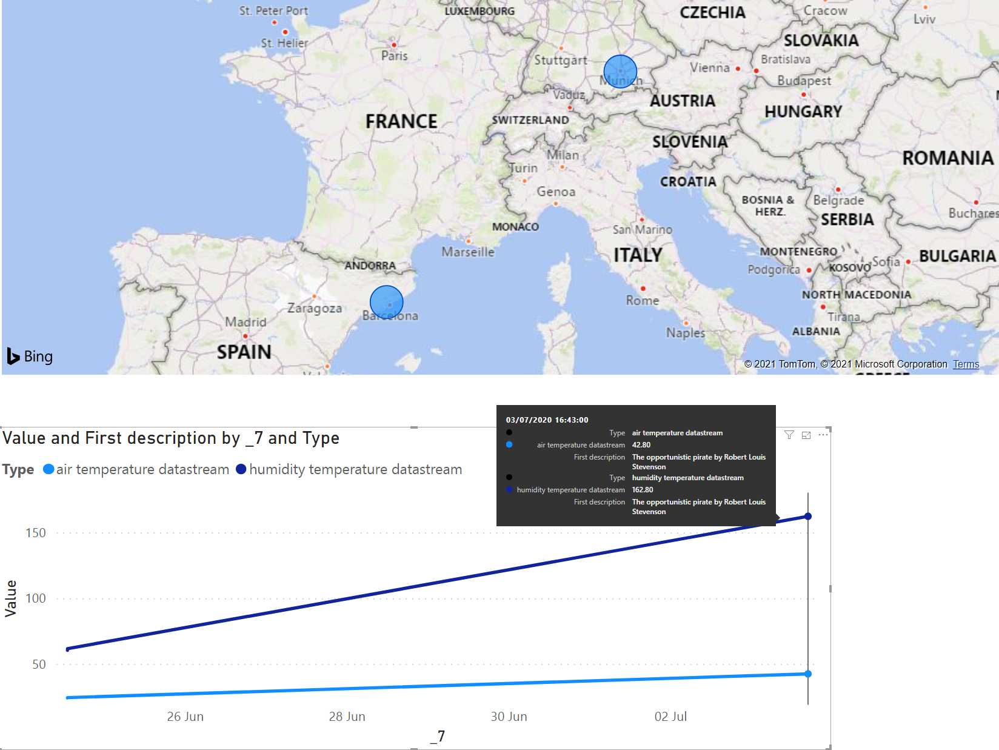
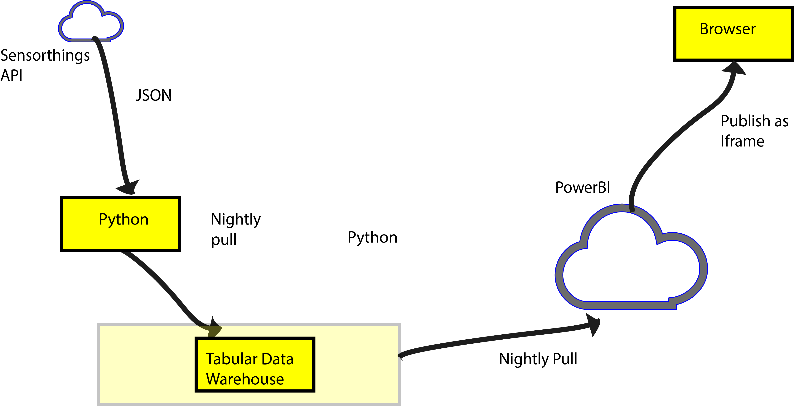

[[STAClients]]
== STA Clients
In this chapter we describe two SensorThings API clients tested in the Interoperability Experiment.

=== STA University of Dundee
This client is a demonstrator application showing the how data from a SensorThings API test server can be retrieved and stored in a tabular data warehouse for off-the-shelf visualization tools to create rich visualizations. In the case of this demonstrator, Microsoft's PowerBi was used, although other commercial tools such as Tableau or Spotfire could be used instead. In addition, free tools such as Grafana, Rawgraphs, or Apache Superset could also be employed.

The data on the test server was very limited but this application with just 10 records. The application makes a call to the server requesting a JSON feed of all parties and transverses the JSON tree to get the observations and their locations for all parties (citizen observers) in the data feed. The initial request is to the "Parties" data feed:

"https://example.org/sta4cs/v1.0/Parties"

The retrieved JSON is parsed and converted into a local CVS file before being consumed by the tabular store.

[source,csv]
.Example of a coma separated CSV intermediate file
----
Long John Silver,The opportunistic pirate by Robert Louis Stevenson,humidity temperature datastream,Point,48.1371,11.5761,Humidity,RH,2020-06-24T12:00:00.000Z,2020-07-03T15:43:00.000Z,60.8
Long John Silver,The opportunistic pirate by Robert Louis Stevenson,humidity temperature datastream,Point,48.1371,11.5761,Humidity,RH,2020-06-24T12:01:00.000Z,2020-07-03T15:43:00.000Z,62.0
Long John Silver,The opportunistic pirate by Robert Louis Stevenson,humidity temperature datastream,Point,48.1371,11.5761,Humidity,RH,2020-07-03T15:43:00.000Z,2020-07-31T12:00:00.000Z,80.8
Long John Silver,The opportunistic pirate by Robert Louis Stevenson,humidity temperature datastream,Point,48.1371,11.5761,Humidity,RH,2020-07-03T15:43:00.000Z,2020-07-31T12:01:00.000Z,82.0
Long John Silver,The opportunistic pirate by Robert Louis Stevenson,air temperature datastream,Point,48.1371,11.5761,Temperature,C,2020-06-24T12:00:00.000Z,2020-07-03T15:43:00.000Z,24.5
Long John Silver,The opportunistic pirate by Robert Louis Stevenson,air temperature datastream,Point,48.1371,11.5761,Temperature,C,2020-06-24T12:01:00.000Z,2020-07-03T15:43:00.000Z,24.7
Long John Silver,The opportunistic pirate by Robert Louis Stevenson,air temperature datastream,Point,48.1371,11.5761,Temperature,C,2020-07-03T15:43:00.000Z,2020-08-04T12:00:00.000Z,20.8
Long John Silver,The opportunistic pirate by Robert Louis Stevenson,air temperature datastream,Point,48.1371,11.5761,Temperature,C,2020-07-03T15:43:00.000Z,2020-08-05T12:00:00.000Z,22.0
Long John Silver Citizen Scientist,The opportunistic pirate by Robert Louis Stevenson,photo datastream,Point,41.485526,2.044367,n/a,,2020-08-01T15:43:00.000Z,2020-08-05T12:00:00.000Z,https://natusfera.gbif.es/attachments/local_photos/files/330575/medium/IMG_20200301_parietaria.jpg?1583141948
Long John Silver Citizen Scientist,The opportunistic pirate by Robert Louis Stevenson,photo datastream,Point,41.485526,2.044367,n/a,,2020-08-01T18:00:00.000Z,2020-08-05T13:00:00.000Z,https://live.staticflickr.com/5579/15296897611_117ee1f1e3.jpg
Long John Silver Citizen Scientist,The opportunistic pirate by Robert Louis Stevenson,text datastream,Point,41.485526,2.044367,en,locale/en_US,2020-08-01T15:43:00.000Z,2020-08-05T12:00:00.000Z,Parietaria officinalis
----

This table of data has the following fields:

Name of Party, description of Party, Name of datastream, location type, Location latitude, Longitude, thing, unit of measurement, phenomenonTime, resultTime and the value of the observation which can be a link to web document such as a picture.

The diagram below shows a typical output using PowerBi, showing the locations of the observations:

[#img-AndyClient,reftext='{figure-caption} {counter:figure-num}']]
.University of Dundee Sensorthings Client

In this approach a Python program has been written to traverse the SensorThings API JSON response, extracting fields that we are interested in. One point to note: it may not be possible to retrieve data from the JSON in the order we which so the data line is built in an internal program structure before being saved to file. Data from the warehouse is pulled nightly into Microsoft's cloud and then published to a web page that makes heavy use of JavaScript to provide an rich exportable interface.

[#img-GROWSOSFlow,reftext='{figure-caption} {counter:figure-num}']]
.Data flow

